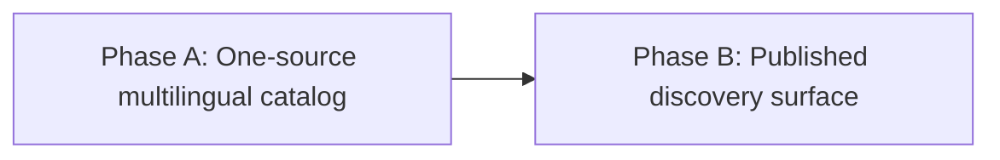

# HL — 20260827-132641__catalog_discoverability: Catalog Discoverability and Multilingual Presentation

> **Date**: 2026-08-27
> **Author**: Coordinator (Codex)
> **Status**: 📝 HL_DRAFT — Awaiting review
> **Contract**: 🔒 FROZEN — approved by saubakirov 2026-08-27
> **Frozen**: §1 · §3 · §4 · §5 · §6 · §7 — locked on owner approval
> **Free**: §2 · §7.2 · §8 · §9 · §10 · §11 — research updates these directly
> **Append-only**: §12 Amendment Log — the only channel for changing a frozen section
> **Baseline**: freeze commits — recovery form in `conventions.md` §3 rule 15

> **Project North Star**: [`README.md` § Purpose](../../../README.md#purpose), generated from [`data/communities.json` `north_star`](../../../data/communities.json)

---

## 1. Vision 🔒 FROZEN

The project presents the best narrow catalog of Kazakhstan Telegram communities, channels,
and bots for IT, startups, engineering, careers, and adjacent technical work. A person arriving
from GitHub, a search engine, or an AI answer can understand the scope, choose English, Russian,
or Kazakh, and reach the right verified community without reading promotional or process-heavy
material first.

**Impact:** The same accurate catalog becomes easier to discover and cite while remaining small,
calm, and useful. Multilingual and machine-readable presentation extends access without creating
three drifting catalogs or weakening the existing accuracy contract.

> “The best is where there is nothing left to remove, not where there is still something to add.”

## 2. Current State (As-Is) 🟢 FREE

The repository already has a strong product core:

- [`data/communities.json`](../../../data/communities.json) is the source of truth;
- [`generate_readme.py`](../../../scripts/generate_readme.py) fully regenerates `README.md`;
- every live entry has a dated verification record and schema validation currently passes;
- `README.md` states the catalog's purpose and non-goals;
- the published page exposes a canonical URL, description, Open Graph title/description, and
  `WebSite` JSON-LD.

The presentation and discovery surface is less coherent than the data:

| Surface | Observed state on 2026-08-27 | Consequence |
|---------|------------------------------|-------------|
| GitHub Pages first screen | Site title, README title, badges, two introductory statements, and Purpose precede the catalog | On a 390 × 844 viewport no community entry is visible before scrolling |
| Heading hierarchy | The rendered page has two `h1` elements: `KZ-IT-telegram-list` and `Awesome Kazakhstan IT Telegram` | The primary identity is visually and semantically ambiguous |
| Markdown portability | A live channel name containing `|` renders as a table fragment on GitHub Pages | The same generated Markdown is not presentation-safe on both GitHub and Pages |
| Language | Catalog presentation and page `lang` are English; Russian descriptions exist in data; Kazakh presentation data does not | The public experience does not match the requested EN/RU/KZ reach |
| Information scent | Job channels, startup material, AI communities, groups, channels, and bots are split by type and partial category coverage | A visitor with a concrete intent must scan multiple sections |
| Site metadata | The page description is inherited from the repository's older bilingual description; no social image is declared | Search and link previews do not express verification, scope, or current product identity precisely |
| Repository discovery | Repository homepage is blank and topics are limited to `almaty`, `astana`, `kazakhstan`, and `telegram` | GitHub's own discovery surface omits the Awesome-list, IT, startup, AI, and jobs intent |
| Search evidence | A broad English query can surface the repository, but the indexed extract observed during planning contained older catalog totals | Discoverability exists, but freshness and presentation consistency cannot be assumed from one search snapshot |

The current baseline is healthy: `validate_schema.py` and `generate_readme.py --check` both pass.
This task must preserve that contract and change presentation through structured data and
generators rather than editing generated output.

Iteration 1 refined the data boundary without copying mutable catalog totals into this document:

- every current live record has a Russian description, while no Kazakh description field exists;
- categories are required and validated only for groups, even though many channels carry category
  values; bots currently carry no category;
- the canonical JSON is already public and responds as `application/json` on GitHub Pages.

The 2026-08-27 cross-render audit found a semantic gap that syntax checks miss: GitHub exposes the
expected live and archive Telegram targets, while Pages loses interactive anchors for `kzquake`,
`mobile_developers_kz`, and `kzqacommunity` even though their URL strings remain in the HTML. The
finite locale inventory and exact dated coverage measurements are retained in Iteration 2 RES rather
than copied here as mutable catalog constants.

## 3. Target State (To-Be) 🔒 FROZEN

| Dimension | As-Is | To-Be |
|-----------|-------|-------|
| Product identity | Repository slug competes with the catalog title | One unambiguous catalog identity across GitHub, Pages, search metadata, and link previews |
| First-screen value | Repeated framing precedes the catalog | One concise promise, current verification signal, language access, and direct paths into the catalog |
| Languages | English presentation with partial Russian data | Complete, navigable EN/RU/KZ public presentation generated from one structured source |
| Browsing | Primarily type-first, with categories only for groups | A minimal navigation model supports both type and high-value intent such as AI, startups, jobs, events, and engineering without duplicating entries |
| Machine access | Humans can read Markdown; structured JSON is discoverable only indirectly | Stable, documented machine-readable catalog data and semantic page structure expose the same facts to crawlers and AI systems |
| Search metadata | Generic repository-derived description and incomplete discovery settings | Accurate titles, descriptions, canonical/language signals, supported structured data, repository topics/homepage, and social preview are aligned |
| Rendering | GitHub and Pages disagree on at least one generated entry and produce two primary headings | Generated output is valid and visually coherent on GitHub, Pages, desktop, and mobile |
| Measurement | Search presence is anecdotal | Indexability, metadata, render quality, link integrity, and public freshness are evidenced; rankings are never promised |

The representation of the three languages — separate generated documents, localized Pages routes,
or another smaller compatible model — remains a research decision. The frozen outcome is that each
language is reachable in one action and all three remain projections of one catalog.

### 3.1 Result Visualization

**Published catalog, mobile first screen — finished-state preview:**

```text
┌──────────────────────────────────────────┐
│ Awesome Kazakhstan IT & Startup Telegram│
│ EN · RU · KZ                            │
│ Verified 2026-08-27                     │
│                                          │
│ Curated communities, channels, and bots │
│ for Kazakhstan's IT ecosystem.          │
│                                          │
│ Communities · Channels · Bots           │
│ AI · Startups · Jobs · Events · Skills  │
├──────────────────────────────────────────┤
│ AI                                       │
│ Cursor Kazakhstan / AI Community         │
│ @cursor_kz · verified catalog entry      │
└──────────────────────────────────────────┘

Phase A — the same structured catalog renders a concise, complete EN/RU/KZ experience.
Phase B — GitHub, Pages, repository metadata, and public evidence expose that experience consistently.
```

The date and catalog facts in the real result remain generated from source data; the date above is
the observed planning snapshot, not a new hardcoded presentation value. The visual deliberately
shows no keyword block, marketing banner, duplicate purpose section, or agent-only shadow catalog.

**Experience across consumers:**

```text
Human visitor      → one clear promise → language or intent → verified Telegram target
Search crawler     → coherent metadata → semantic sections  → current, linkable facts
AI/web agent       → canonical page    → structured JSON    → attributable catalog answer
Repository visitor → focused README    → catalog first      → contribution/data routes second
```

### 3.2 Value Flow

```text
Verified catalog facts + approved multilingual wording
                         │
                         ▼
        schema, completeness, and scope validation
                         │
                         ▼
        one generator → EN / RU / KZ public surfaces
                         │
                         ▼
     GitHub README + GitHub Pages + repository metadata
                         │
                         ▼
 humans find the right community · crawlers index clear facts
 · AI systems cite the same current source · no catalog drift
```

## 4. Phases 🔒 FROZEN

### Phase Dependencies



| Phase | Depends on | Shared files | Can run in parallel with |
|-------|------------|--------------|-------------------------|
| A | Independent after RESEARCH | `data/communities.json`, generator and generated catalog surfaces | — |
| B | Phase A reviewed and approved | Generated catalog surfaces and site metadata | — |

### Phase A: One-source multilingual catalog 🔴

- Establish the researched EN/RU/KZ information architecture and terminology contract.
- Extend the structured source, schema validation, and generator only as needed to produce complete
  multilingual presentation without copying catalog facts between hand-maintained files.
- Make navigation serve both catalog type and the smallest evidence-backed set of high-value intents,
  including IT/startup relevance, AI, jobs, events, and technical disciplines.
- Remove repeated first-screen material and fix generated Markdown portability defects.
- Add proportional automated checks for language completeness, generator currency, links/anchors,
  and cross-render safety.

### Phase B: Published discovery surface 🟡

- Align GitHub Pages title, description, language/canonical signals, supported structured data,
  social preview, and responsive presentation with the catalog contract.
- Align the GitHub repository description, homepage, and topics through explicit owner-validated
  external settings changes.
- Verify the published result on GitHub and GitHub Pages at desktop and mobile sizes, including
  metadata, language routes, machine-readable data, and representative navigation paths.
- Record public indexability and snippet evidence; use Search Console when owner access exists and
  record the exact limitation when it does not.

## 5. Definition of Done (DoD) 🔒 FROZEN

- ✅ 1. One structured catalog is the only owner of community facts, and every EN/RU/KZ public
  presentation is generated or deterministically derived from it.
- ✅ 2. Each language is reachable in one action and provides complete navigation, scope, freshness,
  and entry meaning without forcing all three languages into one long reading flow.
- ✅ 3. The first mobile and desktop screen contains one primary catalog identity, one non-repeated
  value statement, a current generated verification signal, and a direct route into useful entries.
- ✅ 4. Visitors can find groups, channels, bots, and the researched high-value IT/startup intents
  without duplicate catalog records or inclusion of unrelated general-purpose communities.
- ✅ 5. GitHub, GitHub Pages, repository metadata, social previews, and supported structured data use
  accurate, mutually consistent titles, descriptions, URLs, language signals, and catalog scope.
- ✅ 6. Generated Markdown and rendered HTML have valid heading hierarchy, links, anchors, special
  characters, responsive layout, and no known GitHub-versus-Pages presentation break.
- ✅ 7. Automated gates prove schema validity, multilingual completeness, generator currency, and
  bounded presentation invariants before publication.
- ✅ 8. Published evidence covers human usability, crawler-visible metadata, machine-readable access,
  and representative AI/search retrieval without claiming control over ranking.
- ✅ 9. Existing community identity, liveness, counts, and verification facts remain unchanged unless
  separately supported by the project's evidence and owner-approval rules.
- ✅ 10. Every retained first-screen block, metadata field, generated language surface, and repository
  setting has one distinct consumer job; anything redundant is removed.

## 6. Definition of Failure (DoF) 🔒 FROZEN

- ❌ 1. `README.md` or another generated catalog is hand-edited, or catalog entries are duplicated
  into independently maintained language files.
- ❌ 2. Keyword stuffing, query-variant pages, promotional copy, or agent-only prose is added without
  direct human value.
- ❌ 3. English, Russian, or Kazakh wording changes a community's identity or meaning, presents an
  unreviewed inference as fact, or silently falls back to a different language.
- ❌ 4. The catalog expands beyond Kazakhstan-relevant IT, startups, engineering, careers, and
  closely adjacent technical communities in order to gain traffic.
- ❌ 5. Search rank, ChatGPT inclusion, or AI citation is claimed as guaranteed or VERIFIED without
  reproducible public evidence.
- ❌ 6. GitHub and Pages retain competing primary titles, broken entries, unreachable language routes,
  inaccessible mobile navigation, or contradictory metadata.
- ❌ 7. A new website application, content-management layer, client-side search product, or other
  maintenance surface is introduced when generated static content satisfies the researched need.
- ❌ 8. Presentation work mutates live catalog facts without the separate network evidence and owner
  authority required by the existing project contract.

**On failure:** stop the affected phase, preserve or restore the last generator-current reviewed
catalog, record the failing evidence, and return through `/tfw-plan` for a bounded contract decision.

## 7. Principles 🔒 FROZEN

1. **Subtract before adding** — every element must have one distinct job; repeated framing, decorative
   SEO text, and unused surfaces are removed.
2. **Accuracy before reach** — discoverability may expose verified facts more clearly but may never
   relax inclusion, liveness, count, or translation honesty.
3. **One truth, many projections** — EN/RU/KZ, Markdown, HTML, metadata, and machine access derive from
   the same structured catalog rather than synchronize by convention.
4. **People first, machines through clarity** — semantic structure and precise facts should help
   humans, crawlers, and AI systems together; there is no shadow catalog written only for agents.
5. **Narrow is valuable** — Kazakhstan IT, startups, engineering, careers, and adjacent technical
   communities remain the boundary; broader coverage is not automatically better.
6. **Measure what is controllable** — render integrity, indexability, metadata, freshness, and retrieval
   can be evidenced; rankings and model recommendations cannot be promised.
7. **Three languages, one experience** — language access is a product capability, not three piles of
   repeated text; parity and concise navigation are required.

## 7.1 Quality Contract 🔒 FROZEN

- Generated catalog files are never edited directly.
- No placeholder, estimated fact, invented translation, or hidden fallback may ship.
- Catalog totals remain derived at render time and are not copied into hand-maintained documentation.
- New markup or metadata must match visible page content and an officially supported consumer.
- A section, file, tag, or structured-data object without a demonstrated consumer job is removed.
- Search and AI observations are timestamped snapshots, never universal ranking claims.
- Phase B cannot mask a Phase A content defect with styling or metadata.

### 7.2 Knowledge Citations 🟢 FREE

| # | Source | Item | How it applies |
|---|--------|------|----------------|
| PV0 | [`README.md` § Purpose](../../../README.md#purpose) | “A catalog whose value is accuracy” plus the four non-goals | The task may improve access and presentation, but cannot trade curation, verification, non-commercial scope, generated ownership, or exact counts for reach. |
| PV1 | [`.tfw/README.md` § Methodology values](../../../.tfw/README.md#methodology-values) | Candor Over Flattery; Structural Enforcement; Portability | SEO/AI assumptions must be challenged, important multilingual/generation gates must be executable, and durable context cannot depend on one vendor or model. |
| PV1b | [`.tfw/README.md` § Success Criteria](../../../.tfw/README.md#success-criteria) | “The result is ready for acceptance” | Every language and public surface must be complete and inspectable rather than left for manual cleanup after handoff. |
| PV2 | `knowledge/philosophy.md` | N/A — the required priority-2 source does not exist in this project | No additional validated philosophy item can be applied; the explicit gap prevents a fabricated citation. |
| PV3a | [`KNOWLEDGE.md` D1](../../../KNOWLEDGE.md#1-architecture-map) | JSON source of truth plus generated README | Multilingual and machine-facing views must extend the source/generator contract, never create manually synchronized lists. |
| PV3b | [`KNOWLEDGE.md` D11](../../../KNOWLEDGE.md#1-architecture-map) | Project North Star lives in structured data and renders into README Purpose | Scope and non-goals remain data-owned even if their public placement is made more concise. |
| PV3c | [`KNOWLEDGE.md` D13](../../../KNOWLEDGE.md#1-architecture-map) | Freshness is reported, not enforced, by schema validation | Presentation should surface current freshness without turning age into an unrelated content-edit blocker. |
| PV4a | [Conventions §3 — Project North Star](../../../.tfw/conventions.md#project-north-star) | Purpose, principles, and non-goals defend against excess | The target explicitly rejects a portal, keyword farm, and agent-only shadow catalog. |
| PV4b | [Conventions §11 — Quality Standard](../../../.tfw/conventions.md#11-quality-standard-no-compromises) | No placeholders; results usable without manual edits | Partial translations and post-handoff manual SEO cleanup cannot satisfy the task. |
| PV5–6 | `knowledge/convention.md`; `knowledge/process.md` | N/A — neither optional topic file exists after the required scan | Project-specific standards come from the cited architecture and conventions instead. |
| PV7 | [`knowledge/domain.md`](../../../knowledge/domain.md) | F1–F2 concern two archived communities | Read in the required scan; not applicable to presentation architecture, except that archive facts must remain intact. |
| PV8 | [Jekyll front matter](https://jekyllrb.com/docs/front-matter/), [permalinks](https://jekyllrb.com/docs/permalinks/), and [GitHub Pages dependencies](https://pages.github.com/versions/) | Native pages, explicit route metadata, supported SEO and sitemap plugins | Three generated static routes and one repository-owned layout are supported without a custom application or build service. |
| PV9 | [Google localized versions](https://developers.google.com/search/docs/specialty/international/localized-versions) and [sitemaps](https://developers.google.com/search/docs/crawling-indexing/sitemaps/build-sitemap) | Reciprocal language alternates, self-canonicals, and sitemap hints | Every language route must name itself and all peers; these signals support discovery but do not guarantee crawling or rank. |
| PV10 | [Google AI search guidance](https://developers.google.com/search/docs/fundamentals/ai-optimization-guide) and [OpenAI crawler roles](https://developers.openai.com/api/docs/bots) | Ordinary search foundations and crawler eligibility | Visible clarity, access, and accurate metadata are the baseline; no AI-specific prose or inclusion promise is justified. |
| PV11 | [IANA language-subtag registry](https://www.iana.org/assignments/language-subtag-registry/language-subtag-registry) and [RFC 9309](https://www.rfc-editor.org/rfc/rfc9309.html) | Kazakh is `kk`; robots rules live at the host root | Use `/kk/` and `lang=kk`; do not add a misleading project-path `robots.txt`. |
| PV12 | [Google Dataset guidance](https://developers.google.com/search/docs/appearance/structured-data/dataset), [Schema.org Dataset](https://schema.org/Dataset), and [DataDownload](https://schema.org/DataDownload) | Factual linkage from visible catalog to its public JSON distribution | Dataset markup has a bounded programmatic-discovery job when it describes the same catalog and real download URL. |
| PV13 | [W3C language declarations](https://www.w3.org/International/questions/qa-html-language-declarations) | Default document language and genuinely foreign-language fragments | Every route declares its actual locale; a route-level `lang` value does not certify translation quality. |
| PV14 | [GitHub rendered Contents API](https://docs.github.com/en/rest/repos/contents#get-repository-content), [section links](https://docs.github.com/en/get-started/writing-on-github/getting-started-with-writing-and-formatting-on-github/basic-writing-and-formatting-syntax#section-links), and [custom anchors](https://docs.github.com/en/get-started/writing-on-github/getting-started-with-writing-and-formatting-on-github/basic-writing-and-formatting-syntax#custom-anchors) | Commit-addressable rendered Markdown and explicit destinations | Stable generator-owned IDs and rendered anchor assertions are required; display-text slugs are not a cross-language contract. |
| PV15 | [GitHub Pages publishing sources](https://docs.github.com/en/pages/getting-started-with-github-pages/configuring-a-publishing-source-for-your-github-pages-site) and [local Jekyll testing](https://docs.github.com/en/pages/setting-up-a-github-pages-site-with-jekyll/testing-your-github-pages-site-locally-with-jekyll) | Authenticated publication source and pre-public render evidence | Phase B must use the actual configured source; public URL shape is not permission to infer or change it. |
| PV16 | [RFC 8785 JSON Canonicalization Scheme](https://www.rfc-editor.org/rfc/rfc8785.html) | Deterministic review-payload serialization before hashing | Human approval binds to exact locale content through a reproducible digest and changed-key set. |
| PV17 | [Google URL Inspection](https://support.google.com/webmasters/answer/9012289) and [Playwright assertions](https://playwright.dev/docs/test-assertions) | Conditional indexing evidence and executable DOM/viewport checks | Search Console remains optional external evidence; render, link, attribute, viewport, response, and screenshot assertions are locally testable. |

## 8. Dependencies 🟢 FREE

| Dependency | Status |
|------------|--------|
| Current structured catalog, validators, generator, and generator-current README | ✅ Available and passing |
| Owner validation of strategic scope and HL contract | ✅ Approved and frozen 2026-08-27 |
| Multilingual architecture, comparable catalogs, Pages behavior, and supported metadata | ✅ Research complete after Iterations 1–2; no further broad research recommended |
| Native Jekyll routes, layout, SEO tag, and sitemap capability | ✅ Verified within GitHub Pages' supported dependency set |
| Finite locale inventory, review binding, and fail-closed behavior | ✅ Contract complete; exact per-locale payload sizes remain derived from current source |
| Qualified EN/RU/KK payloads and approvals | ⬜ Phase A final acceptance gate; implementation may prepare complete candidates, then Antigravity reviews text quality independently and saubakirov gives the final digest-bound verdict on the ready renders |
| Reviewed intent membership across categories and exceptional handles | ✅ Exact five-intent definitions and entry audit complete for the current snapshot; future sets derive from data |
| Cross-render and metadata evidence contract | ✅ Layered pre-publication and public assertions defined; expected target sets derive from source |
| Authenticated GitHub Pages publishing-source inspection | ⬜ External owner-access boundary; verify before Phase B changes |
| Owner-authorized repository description, homepage, topics, and social-preview changes | ⬜ Required in Phase B with before/after evidence |
| Search Console access | ⬜ Optional evidence dependency; availability unknown |
| Public search, GitHub, GitHub Pages, and relevant official documentation | ✅ Read-only access available during planning |

## 9. Risks 🟢 FREE

| Risk | Probability | Impact | Mitigation |
|------|-------------|--------|------------|
| Three languages turn a concise list into a repetitive document | High | High | Research separate generated routes and require one-action access rather than one-page duplication |
| Kazakh translation is fluent but semantically wrong | Medium | High | Establish terminology, review ownership, completeness gates, and fail closed on uncertain wording |
| SEO ambition creates keyword-heavy content or unrelated scope expansion | High | High | Enforce people-first value, narrow North Star, and the subtractive quality contract |
| GitHub README and Jekyll Pages require incompatible heading/front-matter choices | Medium | High | Test actual GitHub and Pages renders before freezing the implementation design |
| Structured data is technically valid but unsupported or misleading | Medium | Medium | Use only documented types that match visible content and validate rendered output |
| Search and AI results remain stale or variable after publication | High | Medium | Measure indexability and source freshness, document recrawl latency, and never use rank as DoD |
| Repository settings change outside Git and lose traceability | Medium | Medium | Record before/after evidence and require explicit owner validation for external changes |
| A derived intent map silently omits or falsely includes a relevant entry | Medium | High | Use reviewed category-plus-handle definitions and validate every category, handle, anchor, and generated destination |
| Generic HTML validation passes while a rendered catalog link or identity is semantically broken | High | High | Add special-character fixtures plus semantic DOM, heading, route, link-target, and cross-render assertions |
| A translation approval remains marked current after its source payload changes | Medium | High | Bind approval to canonical payload digest, immutable prior approved ref, and recomputed exact changed-key set; fail all locale generation on mismatch |
| The broad Engineering intent appears authoritative but encodes disputed semantics | Medium | Medium | Keep the reviewed category-plus-exception definition and dated entry audit explicit; future semantic changes require source review rather than keyword inference |
| GitHub and Pages silently expose different target sets | High | High | Derive expected anchor text/URL pairs from source and require exact parity across generated Markdown, GitHub render, local Jekyll, and deployed DOM |
| Final-only text review discovers broad language problems late | Medium | High | Stabilize structure and completeness first, present all ready renders plus changed-key manifest together, and repeat the deterministic generation/check loop after every requested wording change |

## 10. RESEARCH Case 🟢 FREE

### Blind Spots

- Which EN/RU/KZ architecture is smallest while remaining usable on both GitHub and GitHub Pages?
- Which Russian and Kazakh query terms and catalog labels match real user intent without keyword stuffing?
- Can a lightweight Jekyll configuration remove the duplicate page identity and provide correct
  per-language metadata without introducing a custom-site maintenance burden?
- Which type/intent navigation model helps users find AI, startups, jobs, events, and technical
  communities without duplicating entries or inventing classifications?
- Which machine-readable and structured-data surfaces are actually consumed by search engines and
  web agents, and which fashionable additions have no evidenced value?

### Hypotheses

| # | Hypothesis | Status |
|---|------------|--------|
| H1 | Separate generated language entry points linked above the fold produce a smaller and clearer experience than one trilingual README while preserving one catalog | confirmed and closed — English `/`, Russian `/ru/`, Kazakh `/kk/`; one finite locale manifest, digest/diff human approval, fail-all completeness gate, and one locale-aware renderer produce `README.md` plus dedicated Pages indexes; Iterations 1–2 D1–D3/D10–D11 |
| H2 | Clear first-screen structure, accurate repository/site metadata, stable facts, and crawlable source data create more defensible search/AI discoverability than `llms.txt`, keyword blocks, or agent-only prose | supported within controllable scope — visible structure, reciprocal routes, coherent metadata, sitemap, public JSON, crawler access, accurate Dataset linkage, and bounded viewport assertions are executable; omit `llms.txt`; rank, indexing latency, and AI inclusion remain observations; D6–D9/D14–D15 |
| H3 | A small derived intent model can expose AI, startups, jobs, events, and engineering across groups/channels/bots without duplicate entries or scope expansion | confirmed for the current snapshot — five reviewed category-plus-exception definitions, explicit stable destinations, and a complete entry audit; future membership derives from validated source and reviewed semantics; D4–D5/D12–D13 |
| H4 | Lightweight GitHub Pages configuration can create one coherent page identity and multilingual metadata while keeping GitHub's README experience intact | confirmed with Phase B access gate — repository-owned Jekyll layout, explicit generated front matter, supported plugins, stable anchors, and layered render/metadata evidence require no custom app or Actions build; authenticated publishing source remains an external precondition; D2–D3/D6/D14–D15 |

### Risks of Not Researching

Without RESEARCH, the project would be assuming that separate language files are the least noisy
choice, that current Pages/Jekyll behavior can support them cleanly, that proposed Kazakh terms are
correct, that intent facets fit the existing data, and that agent-oriented files have any retrieval
value. A wrong assumption would either freeze bloat into the catalog or force an amendment before
execution.

### Proposed RESEARCH Focus

Research is complete after two iterations; no further broad SEO/AEO or architecture investigation is
recommended. The remaining items are typed execution inputs and evidence boundaries, not research
questions:

1. Phase A may prepare complete EN/RU/KK candidates, but acceptance waits until Antigravity has
   independently reviewed text quality and saubakirov has approved the ready rendered result bound
   to its final digest; machine output may propose wording but cannot approve it;
2. authenticated Pages source and exact owner-approved repository setting values enter before their
   Phase B operations;
3. Search Console is conditional evidence; rank, indexing latency, and AI inclusion remain timestamped
   positive-or-negative observations and never acceptance gates.

### Why Not Just...?

- Why not put all three languages in one README? — It maximizes repetition and pushes the catalog
  farther below the fold; H1 must test a smaller generated alternative.
- Why not maintain `README.md`, `README.ru.md`, and `README.kk.md` by hand? — Catalog and translation
  facts would drift, directly violating D1 and the generation contract.
- Why not build a searchable web application? — The current catalog scale and static source do not
  yet justify a new runtime, UI, hosting, accessibility, and maintenance surface.
- Why not add every fashionable SEO/AEO/GEO/agent file? — Unsupported surface area contradicts the
  user's subtractive principle; each addition needs an evidenced consumer and distinct job.

## 11. Strategic Insights (Planning) 🟢 FREE

| # | Insight | Category | Source |
|---|---------|----------|--------|
| S1 | The desired product is the best catalog of communities, channels, and bots, not a general Kazakhstan directory; its useful edge is narrow IT/startup relevance. | domain | User clarification, primary outcome |
| S2 | English, Russian, and Kazakh are all product languages rather than optional later translations. | convention | User clarification, language contract |
| S3 | The same result should be convenient for people, crawlers/bots, and AI systems; machine access must not become a separate truth. | stakeholder | User clarification, consumer scope |
| S4 | “Best” means reaching the point where nothing unnecessary remains, not adding every plausible feature. | philosophy | User's original framing |
| S5 | Language quality is reviewed only after the complete Phase A result is ready: Antigravity may provide an independent advisory pass, while saubakirov gives the final verdict. | process | Owner direction before Phase A TS, 2026-08-27 |

## 12. Amendment Log 🟢 APPEND-ONLY

**No amendments.**

---

*HL — 20260827-132641__catalog_discoverability: Catalog Discoverability and Multilingual Presentation | 2026-08-27*
