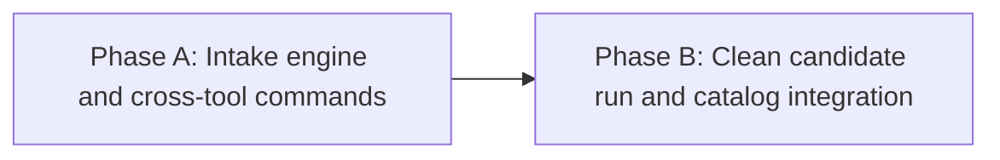

# HL — 20260828-201343__catalog_intake_commands: Verified candidate intake and cross-tool catalog commands

> **Date**: 2026-08-28
> **Author**: Coordinator (Codex)
> **Status**: 📝 HL_DRAFT — Approved; research decision pending
> **Contract**: 🔒 FROZEN — approved by saubakirov 2026-08-28
> **Frozen**: §1 · §3 · §4 · §5 · §6 · §7 — locked on owner approval
> **Free**: §2 · §7.2 · §8 · §9 · §10 · §11 — research updates these directly
> **Append-only**: §12 Amendment Log — the only channel for changing a frozen section
> **Baseline**: freeze commits — recovery form in `conventions.md` §3 rule 15

> **Project North Star**: `README.md § Purpose`, generated from `data/communities.json north_star`

---

## 1. Vision 🔒 FROZEN

The catalog has one small, safe intake command: `/kz-add <source>`. A person can give it one
Telegram link, several links, or a Markdown/text file, and receive an evidence-backed candidate
table before any catalog byte changes. The same literal `kz-*` command surface works in Claude
Code and Codex through complete self-contained command/skill copies whose content parity is
generated or otherwise structurally enforced rather than maintained by convention.

The first complete run processes the owner-supplied six-link file together with the existing
23-candidate discovery batch. Every unique candidate receives a durable disposition; only
communities that pass identity, type, liveness, duplicate, IT relevance, Kazakhstan relevance,
commercial-content, schema, and multilingual-content gates are eligible for owner-approved
inclusion.

**Impact:** Adding a community stops being an error-prone sequence of temporary JSON edits and
manual checks. Coverage can grow without weakening the catalog's defining promise that every
published fact is current, attributable, and verifiable.

> “I can paste a link or point at a list, inspect one honest table, approve exact rows, and know
> the catalog did not trade accuracy for speed.”

## 2. Current State (As-Is) 🟢 FREE

### Command and adapter gap

| Surface | Current state | Consequence |
|---|---|---|
| `/kz-stats` | Full command body exists only in `.claude/commands/kz-stats.md` | Claude can discover it; Codex has no repository skill |
| `/kz-release` | Full command body exists only in `.claude/commands/kz-release.md` | Same cross-tool gap and duplicated-body risk if copied |
| Candidate addition | No project command or canonical workflow | Agents improvise the most safety-sensitive catalog mutation |
| `validate_links.py --handle` | Accepts only an exact handle already present in the live catalog | A new candidate must be staged in source data before its identity can be checked |
| Candidate input | No URL/list/file normalizer | Deduplication and missing-input detection are manual |

The framework already establishes the desired adapter pattern: provider-neutral workflows own
behavior, while Claude command files and Codex skills remain thin discoverable entry points. The
project-specific `kz-*` operations have not yet adopted that pattern.

### Available candidate material

| Input | Rows | Relationship |
|---|---:|---|
| Owner-supplied `Untitled 1.md` content | 6 Telegram links | Fresh intake supplied for this task; its machine-local absolute path is not durable project state |
| `tasks/CANDIDATES-2026-08-28.md` | 23 proposed live communities | Separate discovery batch with preliminary evidence and editorial notes; currently untracked parallel work |
| Cross-input overlap | 1 handle (`aws_kz`) | Demonstrates why normalization and deduplication must precede network work |
| Combined candidate universe | 28 unique handles | Every handle must receive a final disposition; no promise that all 28 qualify for inclusion |

The supplied links already expose non-trivial cases: one requested handle presents a different
canonical identity, one preview advertises a commercial service, and another is a plausible
multilingual AI community. HTTP success alone therefore cannot determine admission.

### Mutation and content constraints

- `data/communities.json` is the only catalog source; the four Markdown projections are generated.
- Live Telegram identity, type, count, and date are external observations and remain Chat-Loop work.
- EN/RU/KK descriptions are mandatory and must be explicit; locale fallback is prohibited.
- A valid handle can still fail the product boundary because it is duplicated, not IT-focused,
  not Kazakhstan-relevant, purely commercial, private, inactive, or bound to the wrong peer.
- The shared checkout already contains the two candidate-discovery changes above. This task must
  preserve their provenance and must not silently absorb unrelated work.

## 3. Target State (To-Be) 🔒 FROZEN

| Dimension | As-Is | To-Be |
|---|---|---|
| Human command surface | Two Claude-only operations and no intake command | `/kz-add`, `/kz-stats`, and `/kz-release` are discoverable in Claude Code and Codex |
| Cross-agent command content | Behavior exists only in Claude adapter files | Every supported agent receives a complete self-contained copy of each command; a reproducible source/copy mechanism and parity gate prevent drift |
| Input shape | Manual handle extraction | One command accepts a Telegram URL, multiple URLs, or a Markdown/text file and reports malformed/duplicate inputs |
| Candidate observation | Candidate must first be inserted into live data | Arbitrary candidates are probed without catalog mutation and emit stable machine-readable evidence |
| Editorial validation | Ad hoc agent judgement | Explicit gates cover identity, declared/observed type, liveness, duplicate/alias, IT, Kazakhstan, commerciality, category, and locale completeness |
| Write boundary | No reusable contract | Preview is non-mutating; only an exact owner-approved candidate set may be applied |
| Test validity | No intake suite | Synthetic branch tests plus a disclosed calibration subset; a holdout subset remains unseen until the clean final run |
| First production use | Candidate notes only | All 28 unique candidates receive a reasoned disposition; every qualifying approved row is added and every non-addition is retained with its reason |

Recurring event notes in the discovery document are not silently converted into communities.
They remain outside this task unless they independently resolve to an eligible Telegram group,
channel, or bot in the 28-handle candidate universe.

### 3.1 Result Visualization

The owner sees one command and one bounded decision, regardless of tool:

```text
Claude Code                                  Codex
───────────                                  ─────
/kz-add <one-link | links | file>            /kz-add <one-link | links | file>
        │                                             │
        └──────── same project operation ─────────────┘

PREVIEW — no catalog mutation
┌──────────────────────────────────────────────────────────────────────────────┐
│ input links: 29 · normalized unique handles: 28 · silently dropped: 0       │
│ duplicate across inputs: aws_kz                                             │
├──────────────┬──────────┬──────────┬────────────┬──────────────┬──────────────┤
│ handle       │ identity │ type/live│ duplicate? │ product fit  │ disposition  │
├──────────────┼──────────┼──────────┼────────────┼──────────────┼──────────────┤
│ every unique input gets one evidence-linked row and one explicit reason      │
└──────────────┴──────────┴──────────┴────────────┴──────────────┴──────────────┘

catalog writes before exact owner approval: 0

OWNER DECISION
  approve exact ADD rows / reject rows / keep unresolved rows

FINAL
  data/communities.json = previous catalog + approved ∩ all-gates-pass
  generated projections = README.md + index.md + ru/index.md + kk/index.md
  evidence = one final disposition for all 28 unique candidates
  inferred facts = 0 · duplicate live/archive handles = 0 · silent omissions = 0
```

The repository surface after both phases is intentionally small:

```text
project command source/copy contract
├── kz-add       [Phase A] complete one/many/file intake with preview and approval gate
├── kz-stats     [Phase A] complete existing contract, preserved without semantic drift
└── kz-release   [Phase A] complete existing contract, preserved without semantic drift

.claude/commands/                     .agents/skills/
├── kz-add.md       ── full copy      ├── kz-add/SKILL.md       ── full copy
├── kz-stats.md     ── full copy      ├── kz-stats/SKILL.md     ── full copy
└── kz-release.md   ── full copy      └── kz-release/SKILL.md   ── full copy

              parity gate: every agent copy is complete and synchronized

scripts + tests [Phase A]             catalog + evidence [Phase B]
└── non-mutating candidate probe      └── clean holdout run, approved additions
```

Phase A makes intake safe and portable. Phase B proves it with the real candidate universe and
ships only what remains true after evidence and owner review.

### 3.2 Value Flow

```text
one link / many links / file
        │
        ▼
normalize syntax and handles ──► expose malformed rows and cross-input duplicates
        │                                      VALUE: nothing silently disappears
        ▼
non-mutating Telegram probe ───► bind identity, type, liveness, date, observed count
        │                                      VALUE: network facts precede source facts
        ▼
catalog + product-fit gates ───► live/archive alias, IT/KZ, commerciality, category, locales
        │                                      VALUE: accuracy governs coverage
        ▼
evidence-linked preview ───────► owner approves exact ADD rows
        │                                      VALUE: judgement remains human-governed
        ▼
atomic source update ──────────► validate schema → regenerate four projections → verify currency
                                               VALUE: one source, no drift, resumable trace
```

## 4. Phases 🔒 FROZEN

### Phase Dependencies



| Phase | Depends on | Shared files | Can run in parallel with |
|---|---|---|---|
| A | Independent | Project-operation routes, validation tooling, command tests | — |
| B | Phase A approved | Intake command, `data/communities.json`, generated projections, tests | — |

### Phase A: Intake engine and cross-tool commands 🔴

- Establish a reproducible source/copy contract for `/kz-add`, `/kz-stats`, and `/kz-release`;
  install complete self-contained command bodies for Claude Code and Codex and enforce parity.
- Extend or compose the existing Telegram classifier so an arbitrary candidate can be probed
  without first entering the catalog, with a stable non-mutating machine summary.
- Accept a single URL, multiple URLs, or a Markdown/text file; normalize handles, deduplicate
  across inputs and the live/archive catalog, and fail visibly on malformed or lost rows.
- Produce an evidence-linked preview with explicit product-fit and completeness gates, followed
  by an exact owner-approval boundary before any source mutation.
- Build deterministic negative fixtures and use a declared subset of real candidates only as a
  calibration set. Seal a disjoint holdout manifest before calibration results can influence it.
- Prove Claude/Codex command discoverability, self-contained execution, and copy synchronization.
- Do not add a production candidate in Phase A.

### Phase B: Clean candidate run and catalog integration 🟡

- Start from the exact reviewed Phase A result and invoke the finished intake path on the sealed
  holdout before using it on the remaining combined source universe.
- Reconcile the six owner-supplied links and the 23-candidate discovery batch into exactly 28
  unique candidate dispositions, including duplicates, aliases, rejected, and unresolved rows.
- Collect candidate-specific identity, type, liveness, count/date, product-fit, category, and
  EN/RU/KK content evidence; never promote preliminary discovery notes into catalog facts.
- Present the exact proposed ADD set to the owner. Apply only owner-approved rows that pass every
  gate; retain a reason for every non-addition.
- Validate the source, regenerate all four projections, run the complete regression suite, and
  re-probe every newly added target against the final catalog state.
- Perform final safe routing smoke checks for Claude Code and Codex and bind results to evidence.

## 5. Definition of Done (DoD) 🔒 FROZEN

- ✅ 1. `/kz-add <source>` accepts one Telegram link, several links, or a Markdown/text file and
  maps every valid occurrence to a normalized handle without silent loss.
- ✅ 2. Arbitrary candidate probing is non-mutating by default, reuses the conflict-safe Telegram
  identity/type classifier, and emits stable machine-readable evidence.
- ✅ 3. Each candidate receives explicit results for requested/canonical identity, observed type,
  liveness, duplicate/alias status across live and archive data, IT relevance, Kazakhstan
  relevance, commerciality, category validity, and EN/RU/KK content completeness.
- ✅ 4. Preview and evidence creation write no catalog facts. Only an exact owner-approved subset
  that still passes every gate can modify `data/communities.json`.
- ✅ 5. `/kz-add`, `/kz-stats`, and `/kz-release` are discoverable and behaviorally equivalent in
  Claude Code and Codex; every agent adapter contains the complete command instructions, and a
  reproducible source/copy mechanism plus parity gate prevents drift.
- ✅ 6. Synthetic positive/negative tests cover parsing, duplicate forms, identity conflict,
  wrong type, dead/private/ambiguous targets, commercial/non-IT/non-KZ rejection, incomplete
  locales, approval absence, partial failure, and idempotent rerun behavior.
- ✅ 7. Calibration and holdout sets are disjoint and recorded before live calibration; holdout
  candidates are not used to tune fixtures, rules, or expected outcomes before the clean run.
- ✅ 8. All 28 unique real candidates receive a final evidence-linked disposition with zero
  silent omissions. Every qualified owner-approved community is added; every other candidate is
  retained as rejected, duplicate, or unresolved with a concrete reason.
- ✅ 9. Every added row contains only observed identity/count/date facts, valid type/category,
  and reviewed explicit EN/RU/KK descriptions; no fallback, estimate, or placeholder ships.
- ✅ 10. Schema validation, generator currency, the predecessor regression suite, new intake
  tests, and exact re-probes of all added entries pass; `README.md` and the three site projections
  are generated rather than hand-edited.
- ✅ 11. Existing `/kz-stats` and `/kz-release` authority, triage, tag, and push gates retain their
  reviewed meaning; this task performs no release, tag, or push as a side effect of intake.
- ✅ 12. Phase A and Phase B each have complete TFW evidence and independent formal review, and
  the final task state names the exact catalog result rather than claiming all inputs qualified.

## 6. Definition of Failure (DoF) 🔒 FROZEN

- ❌ 1. A candidate is inserted into live catalog data merely to make validation possible, or
  preview/probe mode changes catalog or generated files.
- ❌ 2. HTTP success, a description link, an unbound preview, a search result, or owner preference
  is treated as sufficient identity/liveness evidence.
- ❌ 3. A duplicate handle, case variant, URL form, alias, live/archive collision, or cross-input
  duplicate can create a second catalog entry or disappear without a reported disposition.
- ❌ 4. A non-IT, non-Kazakhstan, purely commercial, private, inactive, ambiguous, or wrong-type
  target is added because its URL resolves.
- ❌ 5. Member counts, dates, names, categories, or translations are estimated, inferred from
  unrelated pages, filled through locale fallback, or shipped as placeholders.
- ❌ 6. Any catalog mutation occurs without an exact current owner approval over the displayed
  candidate set, or the applied set differs from what was approved.
- ❌ 7. Holdout candidates or their expected dispositions influence calibration rules/tests before
  the clean holdout run, making the end-to-end evidence circular.
- ❌ 8. A Claude or Codex adapter is a thin runtime link, contains an incomplete command body,
  differs from another supported agent copy without a declared format-only transformation, lacks
  a reproducible parity gate, places a `kz-*` operation inside framework-owned `.tfw/workflows/`,
  or lacks literal command discoverability.
- ❌ 9. Existing `kz-stats`/`kz-release` safety semantics weaken, generated projections are edited
  by hand, predecessor tests regress, or unrelated dirty work is staged or overwritten.
- ❌ 10. The report says “all candidates added” when some failed a gate, or omits rejected,
  duplicate, malformed, and unresolved inputs from the final accounting.

**On failure:** Stop before mutation or publication, preserve raw evidence and the candidate
accounting, return the affected phase to revision, and escalate only the exact unresolved
identity/editorial/authority decision. Never weaken a gate to make the batch pass.

## 7. Principles 🔒 FROZEN

1. **Accuracy governs coverage** — a missing entry is cheaper than a false identity, stale peer,
   duplicate, invented count, or ineligible promotion.
2. **Observation and judgement stay separate** — the network establishes target facts; explicit
   product criteria and owner approval establish admission.
3. **Preview before mutation** — parsing, probing, triage, and approval bind to one exact candidate
   set before source facts move.
4. **Complete copies, enforced parity** — keep the human surface minimal, give each supported
   agent a self-contained command body, and make synchronization a reproducible checked property
   rather than an instruction maintainers must remember.
5. **Fail closed and account for every input** — ambiguity produces an unresolved/rejected row,
   never a guessed record or silent omission.
6. **Holdout evidence must be honest** — final candidates cannot prove generality if their outcomes
   were used to design the rules that later “predict” them.
7. **Generated output remains generated** — edit catalog source and command/tooling sources only;
   regeneration owns README and multilingual site projections.

## 7.1 Quality Contract 🔒 FROZEN

- Every Phase TS must preserve DoF 1–10 and map each principle to an observable AC gate.
- Candidate evidence must bind requested URL/handle, canonical identity signals, declared and
  observed type, run date, and source classification; absence is represented explicitly.
- Automated gates may reject or mark unresolved, but must not fabricate positive editorial
  evidence that the inspected source does not contain.
- Machine summaries use a versioned schema and deterministic UTF-8/LF serialization suitable for
  exact evidence binding and adapter-independent consumption.
- Test fixtures never call live Telegram. Live calibration/holdout results belong only to task
  evidence and are never hardcoded as permanent expected facts.
- Per-user absolute paths, browser/session secrets, cookies, and authenticated Telegram material
  never enter repository artifacts.
- Existing unrelated changes to `tasks/README.md` and `tasks/CANDIDATES-2026-08-28.md` are preserved
  exactly unless the later approved TS explicitly adopts a path and provenance is retained.
- Claude and Codex copies must remain complete enough to execute without opening another command
  body; exact-byte parity is preferred, and any unavoidable format transformation must be
  generated, declared, and tested for semantic parity.

### 7.2 Knowledge Citations 🟢 FREE

| # | Source | Item | How it applies |
|---|---|---|---|
| PV0-1 | [`README.md § Purpose`](../../../README.md#purpose) | “A catalog whose value is accuracy”; IT/Kazakhstan/live/date gates; non-goals exclude promotion, hand-edited output, and estimates | Makes candidate admission stricter than link resolution and forbids guessed facts or commercial placement |
| PV1-1 | [`.tfw/README.md NS2`](../../../.tfw/README.md#ns2) | Purpose before activity; questions before premature answers; human authority; assurance proportional to risk | Requires product-fit questions, an owner approval boundary, and evidence proportional to catalog-fact risk |
| PV1-2 | [`.tfw/README.md Methodology values`](../../../.tfw/README.md#methodology-values) | Structural Enforcement and Portability | Moves gates into versioned summaries/tests and makes complete Claude/Codex copies reproducible rather than manually synchronized |
| PV2-1 | `knowledge/philosophy.md` | N/A — the required priority-2 file does not exist after a full PV scan | No additional validated philosophy item is available beyond PV0/PV1 and `KNOWLEDGE.md §0` |
| PV3-1 | [`KNOWLEDGE.md D1`](../../../KNOWLEDGE.md) | JSON source of truth; README is generated output | Intake mutates `data/communities.json`, never README directly |
| PV3-2 | [`KNOWLEDGE.md D2`](../../../KNOWLEDGE.md) | Separate offline schema/generation work from network-bound link validation | Keeps parsing/tests deterministic and candidate observation explicitly live/CL |
| PV3-3 | [`KNOWLEDGE.md D4`](../../../KNOWLEDGE.md) | Categories live in the data file, not code | Intake validates against current category data rather than embedding another category registry |
| PV3-4 | [`KNOWLEDGE.md D14`](../../../KNOWLEDGE.md) | Project operations use `kz-*`; framework operations use `tfw-*` | Places the new command beside project operations and outside framework-owned workflows |
| PV3-5 | [`KNOWLEDGE.md D18`](../../../KNOWLEDGE.md) | Catalog facts require target-bound evidence and exact-universe reconciliation | Extends the proven identity/evidence boundary to new-candidate admission and final accounting |
| PV3-6 | [`KNOWLEDGE.md D19`](../../../KNOWLEDGE.md) | Explicit EN/RU/KK content with one renderer and no fallback | Makes locale completeness/review a hard add gate |
| PV4-1 | [`.tfw/conventions.md §3 Evidence`](../../../.tfw/conventions.md) | Evidence is real-environment observation, distinct from synthetic verification | Separates live candidate evidence from parser/schema/unit-test results |
| PV4-2 | [`.tfw/conventions.md §9`](../../../.tfw/conventions.md) | Tool adapters normally reference one tool-agnostic core | Establishes the default pattern that owner-approved amendment A1 intentionally replaces for `kz-*` with complete synchronized copies |
| PV4-3 | [`.tfw/conventions.md §11`](../../../.tfw/conventions.md) | No placeholders; results usable without manual repair | Prevents incomplete locale rows and half-applied batches |
| PV4-4 | [`.tfw/conventions.md §14`](../../../.tfw/conventions.md) | No bonus scope, invented evidence, or provider-bound durable truth | Bounds both phases and makes unrelated dirty-work preservation explicit |
| PV7-1 | [`knowledge/domain.md F1–F2`](../../../knowledge/domain.md) | Historical dead communities are archived rather than deleted | Candidate dedupe checks the archive and avoids resurrecting historical handles as fresh rows without continuity evidence |

## 8. Dependencies 🟢 FREE

| Dependency | Status |
|---|---|
| Owner decisions: one `/kz-add`, preview/approval boundary, combined real batch, calibration/holdout split | ✅ Confirmed 2026-08-28 |
| Existing conflict-safe classifier and summary/update primitives in `scripts/validate_links.py` | ✅ Present; arbitrary-candidate path absent |
| Existing reviewed Claude contracts for `/kz-stats` and `/kz-release` | ✅ Present; Codex project skills absent |
| Claude command discovery and Codex repository-skill discovery behavior | ⬜ Requires research and executable smoke design |
| Six-link owner input | ✅ Read; absolute machine path must not become durable project state |
| `tasks/CANDIDATES-2026-08-28.md` 23-candidate discovery batch | ⬜ Present as unrelated untracked work; provenance/adoption boundary must be resolved before execution |
| Live Telegram public previews and rate-limited access during Phase B | ⬜ External dependency; failures remain unresolved rather than inferred |
| Owner approval of exact final ADD rows | ⬜ Required after preview; planning approval does not satisfy it |
| EN/RU/KK copy quality review for new entries | ⬜ Required before final inclusion |

## 9. Risks 🟢 FREE

| Risk | Probability | Impact | Mitigation |
|---|---|---|---|
| Telegram preview binds a requested handle to another canonical identity | High | High | Preserve all identity signals; conflict fails closed; browser/authenticated fallback only with bounded evidence |
| Candidate rules overfit the known discovery batch | Medium | High | Seal a disjoint holdout and prohibit its use in calibration expectations |
| Editorial fit is presented as an objective network fact | Medium | High | Separate observation fields from IT/KZ/commercial disposition and retain cited grounds |
| Alias/URL/case variants bypass exact-handle dedupe | Medium | High | Normalize before probing; compare live, archive, cross-input, canonical, and known-replacement identities |
| Generated multilingual body digest changes with accepted descriptions | High | Medium | Treat locale change as expected reviewed Phase B output and rebind exact digest after copy review |
| Rate limits or private previews leave partial batches | Medium | Medium | Resume from versioned per-candidate evidence; never apply a partial unaccounted set |
| Full self-contained command copies drift between agent surfaces | High | High | Research a reproducible source/copy mechanism and enforce exact or semantic parity in tests |
| Shared untracked discovery work is overwritten or accidentally staged | Medium | High | Snapshot hashes/provenance read-only; use path-scoped edits/commits; stop on unexplained drift |
| “Add everything” is misread as bypassing eligibility gates | Medium | High | Define completion as 28 dispositions and all qualified approved additions, never unconditional insertion |

## 10. RESEARCH Case 🟢 FREE

### Blind Spots

- The smallest source/copy layout that gives Claude Code and Codex complete self-contained command
  instructions while keeping every agent copy reproducibly synchronized and outside framework-managed `.tfw/`.
- Whether extending `validate_links.py` with a non-mutating arbitrary-candidate mode preserves its
  current identity guarantees cleanly, or whether a separate composition layer is safer.
- How to prove literal command discoverability in both tools with reproducible evidence rather
  than only checking that adapter files exist.
- Which evidence fields can support IT/Kazakhstan/commercial pre-classification and which require
  explicit owner judgement per candidate.
- A defensible calibration/holdout partition that covers hard cases without leaking expected
  holdout dispositions into Phase A design.

### Hypotheses

| # | Hypothesis | Status |
|---|---|---|
| H1 | Claude Code commands and Codex repository skills can route the same literal `kz-*` surface to provider-neutral project workflows, including the two existing operations, without copied behavior | refuted — cross-tool feasibility confirmed by owner; thin-link/no-copy architecture superseded by approved A1 requiring full synchronized copies |
| H2 | The existing Telegram classifier can expose an arbitrary non-mutating candidate probe with a stable summary while preserving every current identity/type/update/archive safety property | open |
| H3 | One `/kz-add <source>` grammar can unambiguously cover a single URL, multiple URLs, and Markdown/text files while remaining idempotent and accounting for every malformed/duplicate input | open |
| H4 | The 28-candidate universe can be partitioned into calibration and holdout sets so automated evidence narrows owner work without pretending that theme, Kazakhstan relevance, or commerciality are purely machine facts | open |

### Risks of Not Researching

Without research, the task would freeze an unverified adapter layout, risk weakening a previously
reviewed Telegram classifier, and create circular “real-world” tests whose expected outcomes were
known during rule design. It could also automate editorial judgement that the project deliberately
keeps human-governed.

### Proposed RESEARCH Focus

1. **Gather:** Map current Claude/Codex discovery contracts, existing `kz-*` semantics, classifier
   extension seams, candidate data shapes, and comparable safe intake patterns.
2. **Extract:** Compare reproducible full-copy source/synchronization layouts, probe/composition
   architectures, input grammar designs, approval-state representations, and calibration/holdout partitions.
3. **Challenge:** Test identity conflicts, aliases, private/dead/wrong-type previews, partial
   failures, duplicate forms, editorial ambiguity, adapter drift, and holdout leakage.

### Why Not Just...?

- Why not add the 28 candidates by hand first? — It repeats the current unsafe temporary-data
  workaround and leaves the next batch unsolved.
- Why not create `/kz-import` beside `/kz-add`? — The user action is the same; source cardinality
  is input syntax, not a second operation. A second command is justified only if research proves
  the safety or approval semantics genuinely differ.
- Why not use thin routes into one canonical workflow? — The owner explicitly requires every
  supported agent command/skill to contain a complete self-contained copy. Research must retain
  this runtime property while making copy parity structurally verifiable rather than habitual.
- Why not auto-add every verified HTTP target? — Liveness does not establish correct identity,
  declared type, uniqueness, IT/Kazakhstan relevance, non-commercial fit, or multilingual quality.

## 11. Strategic Insights (Planning) 🟢 FREE

| # | Insight | Category | Source |
|---|---|---|---|
| S1 | The owner wants command/workflow/skill terminology treated as implementation detail; the durable product is one literal operation available in both Claude and Codex | stakeholder | User, initial request |
| S2 | Minimality matters: one command should accept a link or a list instead of multiplying commands for source shape | philosophy | User approved the single-command recommendation |
| S3 | Safety is interactive: candidates must be previewed as an exact set and approved before mutation | process | User approved the two-stage boundary |
| S4 | The real candidate corpus must do double duty without invalidating the final proof: some candidates calibrate the tooling, while a disjoint set remains unseen for a clean end-to-end run | constraint | User explicitly requested calibration plus clean final candidates |
| S5 | “Add all” means the workflow must fully process the combined corpus, but the project's value and goal still outrank coverage; ineligible or unverifiable candidates need explicit non-add dispositions | philosophy | User clarified that normal duplicate/topic/liveness validation and project purpose govern every candidate |
| S6 | Cross-agent commands must be self-contained complete copies, not thin runtime links; synchronization must therefore be enforced by source/copy tooling and parity checks | constraint | User correction during H1 iteration |

## 12. Amendment Log 🟢 APPEND-ONLY

| # | Date | § | Type | Proposer | Proposed change | Evidence | Cost | Alternatives considered | Verdict |
|---|---|---|---|---|---|---|---|---|---|
| A1 | 2026-08-28 | §§1, 3, 4, 5, 6, 7 | `SUPERSEDE` | saubakirov | Replace thin runtime routing and a single referenced workflow body with complete self-contained command/skill copies for every supported agent; require generated or otherwise reproducible synchronization and parity gates | Owner H1 correction: existing projects/adapters demonstrate cross-tool feasibility, but every agent skill must contain the full instructions with no thin links | Additional maintained bytes, a source/copy convention, synchronization tooling/tests, and an explicit task-level exception to the default thin-adapter pattern | Keep the frozen thin-adapter design (lowest drift risk but violates the stated runtime requirement); hand-copy full bodies without enforcement (meets self-containment but makes drift likely) | `✅ APPROVED — saubakirov, 2026-08-28` |

---

*HL — 20260828-201343__catalog_intake_commands: Verified candidate intake and cross-tool catalog commands | 2026-08-28*
