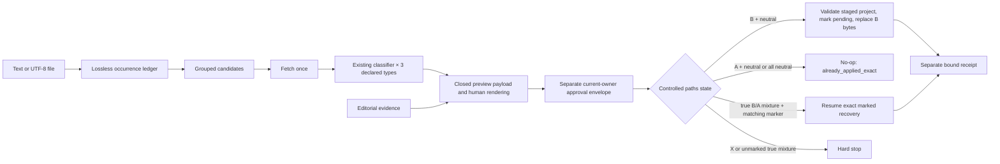

# RF — 20260828-201343__catalog_intake_commands / Phase A: Intake engine and cross-tool commands

> **Date**: 2026-08-28
> **Author**: Executor (Codex)
> **Status**: 🟢 RF — Complete
> **Parent HL**: [Master HL](../HL-20260828-201343__catalog_intake_commands.md)
> **Phase HL**: [Phase A HL](HL__phase-a__intake_engine.md)
> **TS**: [TS Phase A](TS__phase-a__intake_engine.md)
> **Revision source**: [Formal REVIEW](REVIEW__phase-a__intake_engine.md) (`REVISE`)
> **Revised implementation SHA**: `3b06f143102bb90b3bd47f994607371bb3f0df45`
> **Accepted unchanged-command smoke SHA**: `f8fd50224e4f3a4e0b518a4db4813b034d2dff1a`

---

## 1. What Was Done

Phase A implemented a lossless Telegram candidate intake engine without changing a production
catalog or projection byte. It added a fixed source grammar and occurrence ledger, fetch-once
three-type reconciliation through the existing classifier, closed canonical preview/approval
contracts, and an exact-state crash-aware fixture apply boundary. It also installed complete
byte-identical `kz-add`, `kz-stats`, and `kz-release` command pairs for Claude and Codex with an
explicit Claude-to-Codex parity gate.

The formal-review revision closes the trailing-dot authority, recursive integer/blank-evidence/
failed-transport schema, and neutral controlled-path idempotency findings. It also replaces runtime
summaries with self-contained complete redacted accepted records, binds the Coordinator-owned
non-revealing allocation receipt, and retains a complete revised-SHA official-image build record.

### New Files

| File | Description |
|------|-------------|
| `scripts/kz_intake.py` | Source parsing, observation reconciliation, closed canonical preview/envelope contracts, neutral-aware exact-state apply orchestration, and CLI. |
| `scripts/sync_kz_commands.py` | Exact three-command inventory, completeness/parity validator, and explicit Claude-to-Codex sync. |
| `scripts/test_kz_intake.py` | Synthetic adversarial parser, recursive schema, classifier, authority, neutral-path idempotency/failure, and recovery tests. |
| `scripts/test_kz_commands.py` | Inventory, metadata, body completeness, parity, drift, and sync-direction tests. |
| `.claude/commands/kz-add.md` | Complete location-neutral Claude `/kz-add` runtime contract. |
| `.agents/skills/kz-add/SKILL.md` | Byte-identical Codex `/kz-add` runtime contract. |
| `.agents/skills/kz-stats/SKILL.md` | Byte-identical Codex `/kz-stats` runtime contract. |
| `.agents/skills/kz-release/SKILL.md` | Byte-identical Codex `/kz-release` runtime contract. |
| `phase-a/evidence/calibration-observations.json` | Exact eight-candidate read-only calibration observations and lossless source ledger. |
| `phase-a/evidence/production-hashes-*.json` | Pre/post calibration, pre-AC-7, and final controlled-path hash checkpoints. |
| `phase-a/evidence/site-metadata-summary.json` | Parsed deterministic built-site metadata summary. |
| `phase-a/evidence/claude-runtime-smoke.jsonl` | Self-contained complete redacted accepted Claude invocations/results, exact bindings, and separately excluded deviations. |
| `phase-a/evidence/codex-runtime-smoke.md` | Complete fresh non-forked Codex final report, exact input, loaded paths/hashes, outputs, and state. |
| `phase-a/evidence/partition-audit.json` | Coordinator-owned non-revealing allocation-authority receipt for full partition/calibration inclusion. |
| `phase-a/evidence/jekyll-build-revision.txt` | Revised exact-SHA official-image build command, environment, complete output, validation, and hashes. |
| `phase-a/evidence/EV__phase-a__intake_engine.md` | Per-AC verification, live calibration, runtime, hashes, scope, and mutation evidence. |

### Modified Files

| File | Changes |
|------|---------|
| `scripts/validate_links.py` | Added the minimum immutable fetch/retry seam; existing classifier authority bodies remain unchanged. |
| `.claude/commands/kz-stats.md` | Made the existing complete owner-triage command location-neutral and parity-ready without weakening repair/archive authority. |
| `.claude/commands/kz-release.md` | Made the existing complete release command location-neutral and parity-ready while preserving pre-tag/pre-push approval. |
| `AGENTS.md` | Registered the truthful three-command project inventory and distinguished availability from execution evidence. |

The implementation budget is exactly 12 paths: 8 new, 4 modified, and 1,957 total
insertion+deletion lines. Evidence and lifecycle traces are outside that implementation budget.

## 2. Key Decisions

1. Production source grammar remains fixed to root HTTPS `t.me`, `telegram.me`, and
   `telegram.dog` handle URLs. The disclosed calibration's derived URLs were consumed without
   broadening production input to bare handles or salvaging parent/prefix forms. Authorities are
   compared literally after case-folding; trailing dots are not normalized away.
2. One immutable fetch result is decoded once and passed unchanged through the existing
   target-bound classifier for all three declared types. No second identity classifier was added;
   all six established classifier authority bodies remain exact to the approved base.
3. `kz-canonical-json/v1` is a small standard-library-only closed domain for the exact Phase A
   payload/envelope/marker/receipt schemas, not a general JCS implementation. Recursive integer
   fields exclude JSON booleans, evidence references must be non-blank, and verified observations
   require successful transport.
4. Preview payload, current owner approval, pending recovery marker, and receipt remain separate
   objects. A path whose approved before/after hash is equal is neutral/both; changing paths still
   use B/A/X. Apply may replace bytes only from exact all-before state or a matching durable marked
   true mixture; A plus neutral is an exact no-op and every unknown/unmarked true mixture stops.
5. Claude command files are the explicit sync source, but both runtime copies are complete
   standalone bodies. Exact byte parity and fresh runtime behavior jointly establish portability.
6. The original implementation was committed cleanly before AC-7. Fresh Claude and non-forked
   Codex smokes ran at that exact SHA; their complete accepted records now live in the repository.
   The revised SHA changes only intake code/tests, while all command bodies remain byte-identical,
   so the Coordinator did not require a model rerun.
7. Phase A used only the approved predecessor offline matrices and exactly eight disclosed
   calibration probes. It did not run the generic live full-catalog validator or use browser/auth
   fallback. The existing observation artifact remains byte-identical and validates under the
   stricter contract, so calibration was not refreshed.
8. Coordinator-owned `partition-audit.json` supplies allocation authority without revealing any
   holdout identity or path. The Executor cites it but did not seek sealed material.

## 3. Acceptance Criteria

- [x] AC-1 — Every Telegram-like occurrence is accounted for before grouping; only literal fixed root HTTPS authorities produce candidates, including explicit trailing-dot rejection.
- [x] AC-2 — Arbitrary candidates are fetched once, reconciled through all three unchanged classifier calls, and fail closed on every non-exact tuple.
- [x] AC-3 — Canonical preview bytes and authority are recursively closed, excluding boolean integers, blank evidence, and verified/failed-transport contradictions.
- [x] AC-4 — Apply treats equal before/after paths as neutral, remains exact-state idempotent, permits only marked true-mixture recovery, emits a separate receipt, and never touches production in Phase A.
- [x] AC-5 — Both runtime locations contain exactly the three complete byte-identical `kz-*` commands with non-mutating parity checks and preserved authority stops.
- [x] AC-6 — Only the committed eight-case calibration entered execution; the non-revealing allocation receipt proves its full-partition membership without exposing holdout/source material.
- [x] AC-7 — Self-contained complete redacted fresh Claude records and the complete non-forked Codex report prove sentinel routing, stats triage, release approval boundaries, local-body binding limits, and zero mutation.
- [x] AC-8 — Approved tests/build/validation, predecessor behavior, exact scope, final hashes, and zero external mutation all pass.

## 4. Verification

- Tests: `python -m unittest scripts.test_catalog_generation scripts.test_kz_intake scripts.test_kz_commands -v` — PASS, 36 tests, including every D1–D3 counterexample and neutral-path failure/idempotency branch.
- Command parity: `python scripts/sync_kz_commands.py --check` — PASS, exact `kz-add`, `kz-stats`, `kz-release` inventory.
- Compile: `python -m py_compile ...` for all five changed/new Python runtime/test modules — PASS.
- Schema: `python scripts/validate_schema.py` — PASS, 0 errors across 38 groups, 20 channels, 4 bots, 19 categories, and 2 archive entries.
- Projection currency: `python scripts/generate_readme.py --check` — PASS, all 4 projections current.
- Index: `python docs/scripts/gen_index.py --validate` — PASS, 4 tasks validate.
- Predecessor behavior: direct `run_link_matrix` and `run_command_matrix` from the Phase C
  `offline_harness.py` — PASS, including retry, identity decoy/conflict, summary/update/archive,
  and stats/release command behavior.
- Classifier audit: six authority bodies match base
  `be830d3766ca4de12ff18198a680253ed133894f` exactly — PASS.
- Built site: official local `actions/jekyll-build-pages:v1.0.13` read-only build at revised SHA
  followed by `python scripts/test_site_metadata.py --site <temporary-build>` — PASS for EN/RU/KK
  routes; complete command/environment/output retained in `evidence/jekyll-build-revision.txt`.
- Calibration: one bounded probe for each of exactly eight disclosed candidates — 8 fetched,
  8 verified, 0 unresolved, 0 fallback, 0 mutation. No revision rerun: the existing artifact's
  SHA-256 remains `507938e…` and all observations pass the stricter validator.
- Partition allocation: Coordinator receipt SHA-256 `6febc879…` binds full partition `5b9fb0dd…`
  and proves `29/28/1/8/20`, eight-lowest calibration, and exact disclosed key/occurrence equality
  without holdout disclosure — PASS.
- AC-7 runtime: three fresh Claude sessions and one fresh non-forked Codex task at
  `f8fd50224e4f3a4e0b518a4db4813b034d2dff1a` — PASS with complete accepted results, exact
  runtime hashes, and clean before/after state. Commands are unchanged at revised SHA `3b06f143…`.
- Scope: implementation commit contains exactly 12 implementation paths, 8 new/4 modified,
  1,957 insertion+deletion lines — PASS.
- Formatting/state: `git diff --check`, final status/staging audit, and five controlled-path hashes
  — PASS; production hashes are unchanged at every checkpoint.

Exact deviations:

- The generic configured `python scripts/validate_links.py` full-catalog live command was not run,
  by explicit TS/Coordinator boundary. Phase A used the approved predecessor offline suites plus
  exactly eight disclosed probes.
- The historical Phase C harness's full `main()` contains an unrelated stale fixed production-date
  assertion. The ONB-approved TS-relevant `run_link_matrix` and `run_command_matrix` were called
  directly and both passed.
- Before the accepted Claude invocations, one direct PowerShell attempt lost the empty tools
  argument and exited before model execution, one ProcessStartInfo attempt was policy-rejected
  before start, and one quoting probe returned unexecuted tool-call proposal text. All had zero
  writes/network, were superseded, and are explicitly excluded from accepted evidence.
- Claude did not echo an absolute loaded command path. Evidence claims only the project setting
  source plus matching literal-command behavior and the independently bound local path/hash/parity;
  Codex separately reports absolute loaded paths and hashes.
- The formal Reviewer's attempted fresh Jekyll reproduction was policy-rejected before process
  start. This Executor's later supported official-image reproduction at revised SHA started and
  exited 0; the rejected attempt is retained as a limitation, not converted into success.

## 5. Evidence

See [EV file](evidence/EV__phase-a__intake_engine.md) for evidence details.

Evidence verdict: 8/8 VERIFIED, 0 DEFERRED, 0 BLOCKED, 0 N/A

## 6. Observations (out-of-scope, not modified)

| # | File | Line(s) | Type | Description |
|---|------|---------|------|-------------|
| 1 | `tasks/TFW-4__showcase_reorg/phase-c/evidence/offline_harness.py` | 279 | todo | The historical full harness asserts `oldest_live == 2026-01-30` while labeling the date dynamic; the current catalog's oldest live date is `2026-08-27`. The reusable link and command matrices pass, but a future full-harness run needs its snapshot assertion updated through the owning task. |

## 7. Fact Candidates

No fact candidates. The Coordinator messages supplied execution authority and evidence bindings,
not new human-only domain facts.

## 8. Strategic Insights (Execution)

No strategic insights. The execution followed the already approved TS and ONB recommendations;
no new stakeholder domain correction or strategy was introduced during implementation.

## 9. Diagrams

---

*RF — 20260828-201343__catalog_intake_commands / Phase A: Intake engine and cross-tool commands | 2026-08-28*
