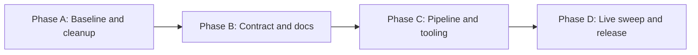

# HL — TFW-4: Showcase Reorganization — commit the trace, consolidate the contract, automate the promise

> **Date**: 2026-08-26
> **Author**: Coordinator (Claude Code)
> **Status**: 🟡 TS_DRAFT — A6 approved; Phase B planning
> **Contract**: 🔒 FROZEN — approved by saubakirov 2026-08-26
> **Frozen**: §1 · §3 · §4 · §5 · §6 · §7 — locked on owner approval
> **Free**: §2 · §7.2 · §8 · §9 · §10 · §11 — research updates these directly
> **Append-only**: §12 Amendment Log — the only channel for changing a frozen section
> **Baseline**: freeze commits — recovery form in `conventions.md` §3 rule 15

> **Project North Star**: `N/A — no project north star designated`
> *(This task creates it. From Phase B onward the locus is `README.md § Purpose`, generated from
> the `north_star` block in `data/communities.json`. Until Phase B lands, the Purpose Check falls
> back to §1 Vision at the contract baseline — `conventions.md` §3 → Project North Star, rule 5.)*

---

## 1. Vision 🔒 FROZEN

A visitor arriving at this repository to evaluate Trace-First Workflow finds the method
working on itself: a `git log` in which every decision has a trace, a README that states in
its first screen what the catalog is for and what it refuses to become, and two commands that
turn the catalog's central promise — *these communities are alive and these numbers are real* —
from a manual chore into a repeatable, dated, evidenced operation.

**Impact:** The repository stops being a list that happens to use TFW and becomes the
reference implementation of it. For the owner: publishing a verified snapshot becomes one
command instead of a five-step checklist nobody runs. For a contributor: one canonical rules
document instead of two that disagree. For a TFW evaluator: the claim "traces over code" is
checkable against history rather than asserted in a README.

> "I sent someone the repo instead of explaining the methodology, and they got it."

## 2. Current State (As-Is) 🟢 FREE

### The trace is in history — resolved by the owner mid-planning

**Superseded 2026-08-26.** At the moment this HL was drafted, the entire TFW-3 result was
untracked and `git log` ended at `7ab6972 Fix README badge…`. That was the finding which
made Phase A the first phase. While the HL was being written, the owner committed it:

```
0fe6c67 [claude-code/TFW-3/init/coordinator] initialize TFW 1.3.0
        Sanzhar, Wed Aug 26 21:19:29 2026 +0500 — 86 files
```

Verified against DoD 2 and DoD 3:

| DoD 2 requires | Present in `0fe6c67` |
|----------------|---------------------|
| `.tfw/` | ✅ 60 files |
| `CLAUDE.md` | ✅ |
| `KNOWLEDGE.md` | ✅ |
| `TECH_DEBT.md` | ✅ |
| `tasks/README.md` | ✅ |
| `tasks/TFW-3__tfw_init/` | ✅ 3 files (HL, RES, RF) |
| §4 attribution grammar | ✅ `[claude-code/TFW-3/init/coordinator]` |
| No backdated author or commit date | ✅ authored and committed 2026-08-26 |
| `STEPS.md`, `TASK.md`, `.agent/rules/agents.md` deleted | ✅ all three `D` in the same commit |

Phase A deliverables 2 and 3 are therefore already satisfied — filed as §12 A1 (`RESTRICT`).

### What Phase A still has to do

| Artifact | State |
|----------|-------|
| `.agent/rules/conventions.md` | tracked, present — duplicates `.tfw/conventions.md` (TD-7) |
| `.agent/rules/glossary.md` | tracked, present — duplicates `.tfw/glossary.md` (TD-7) |

`.agent/rules/agents.md` went with `0fe6c67`; the other two did not. The directory survives as
a stray adapter for a tool no longer in use, holding the only two files in the repository that
duplicate `.tfw/` verbatim. Deliverable 1 stands unchanged.

Deliverable 5 also stands, and its verification found a conflict with DoD 3 as written — filed
as §12 A2 (`SUPERSEDE`), approved by saubakirov on 2026-08-26 and applied in DoD 3. The
current contract baseline is freeze commit `70ddfa6`.

### A third adapter arrived mid-planning

**Added 2026-08-26,** after the freeze commit `2b1f0d2`. The owner installed the Codex
adapter while research was being opened:

| Artifact | State | Bearing on this task |
|----------|-------|---------------------|
| `.agents/skills/tfw-*/SKILL.md` | 11 files, untracked | New adapter surface. Phase B's repository map must list it; Phase C should consider whether `/kz-stats` and `/kz-release` need Codex counterparts |
| `AGENTS.md` `<!-- TFW:CODEX:START -->` block | +36 lines, uncommitted | **Machine-managed region.** Phase B rewrites `AGENTS.md` around it and must not hand-author inside the markers — that content is adapter-generated, `/tfw-update` territory (DoF 8's rationale) |

This **strengthens** D9 rather than disturbing it: `conventions.md` §9 names root `AGENTS.md`
as the Codex adapter's own entry point, so `AGENTS.md` is now canonical by the framework's
definition and not merely by this task's preference. No amendment needed.

It does introduce a deletion hazard. The repository now contains both:

```
.agent/    ← singular  — dead Antigravity-era adapter, Phase A DELETES this
.agents/   ← plural    — live Codex adapter, MUST SURVIVE
```

One character apart, adjacent in any directory listing, opposite fates. Filed as §12 A3
(`RESTRICT`) so the guard sits in §6 where an executor reads it, not only here.

### Documentation defects

| # | Location | Defect |
|---|----------|--------|
| F2 | `README.md`, `tasks/README.md` | No Project North Star anywhere. PV priority 0 is empty; `templates/review/judge.md` row 2a has nothing to read |
| F3 | `AGENTS.md` § Purpose | Hardcodes `40 groups · 18 channels · 5 bots · 18 categories` **in the sentence that forbids hardcoding them**. Same class as the "23 channels" bug TFW-3 resolved |
| F4 | `CONTRIBUTING.md:24` | `git push origin main` — the branch is `master` |
| F5a | `CONTRIBUTING.md` § Allowed Categories | Hand-copied 18-row table duplicating the `categories` map in `data/communities.json` |
| F5b | `CONTRIBUTING.md` § Handle Dead Links | Literal `Move to \`archive\` section (TODO)` — a placeholder in a repo whose stated rule is *No placeholders* |
| F17 | `AGENTS.md` ↔ `CLAUDE.md` | ~60% overlap: generation contract, change procedure, data rules stated twice with no mechanism keeping them equal |
| F9 | *(absent)* `RELEASE.md` | `/tfw-release` prerequisite unmet; `.tfw/VERSION` is the framework version, not the project's. The command cannot run in this repo |
| F10 | `.agent/rules/` | Still holds `conventions.md` + `glossary.md`, duplicating `.tfw/` (TD-7) |

### Pipeline defects

| # | Location | Defect |
|---|----------|--------|
| F6 | `scripts/validate_links.py:176` | `--update` refreshes `last_verified` only `if member_count is not None`. The 4 entries with no parseable count can never have their verification date refreshed, even after a successful liveness check |
| F7 | `scripts/generate_readme.py:31`, `:70` | Categories sorted by **key**, rendered by **display name** → `Engineering Management` renders after `Jobs & Careers` in both TOC and body |
| F8 | `scripts/generate_readme.py:132` | Stats line emits counts only. No verification date, no category count. A catalog whose entire value proposition is accuracy publishes no freshness signal at all |
| F11 | `data/communities.json` `meta.last_updated` | `2026-01-30`; no script reads or writes it (TD-6) |
| F12 | `scripts/generate_readme.py:13` | `datetime` imported, never used |
| F13 | `scripts/validate_links.py` liveness classifier | Marker-free HTTP 200 contact shells are treated as alive without target-specific evidence, while a generic Telegram landing page can yield a false count `0` from site-wide prose containing `200,000 members` |

### Data state

| Metric | Value |
|--------|-------|
| Groups · channels · bots | 40 · 18 · 5 (63 total) |
| Categories defined | 18 |
| Entries with no `member_count` | 4 |
| Distinct `last_verified` values | **1** — `2026-01-30` for all 63 entries |
| Staleness | ~7 months (TD-2, severity High) |
| Dead-community archive | none — TFW-02 deleted 12 entries; the record exists only in a commit diff (TD-4) |

### C4 identity evidence — resolved design, pending owner-authenticated observation

Iteration 2 established that the `mobile_developers_kz` row has catalog provenance dating to
2017, while both its plain `t.me` page and `/s/` surface currently return the same ambiguous
contact shell (C4). That proves historical presence, not the peer currently bound to the stored
username and not the death of the historical community.

The evidence boundary is now explicit:

| Observation after retry | Disposition |
|-------------------------|-------------|
| Target-specific public preview, or authenticated resolution to the intended peer with matching kind and continuity | Verify the target; refresh `last_verified`; a numeric count remains optional |
| Authenticated evidence of a living replacement link | Repair the link, recheck the target, then refresh `last_verified`; do not archive it as dead |
| Broken current binding plus independent evidence that identifies the same historical community as deleted or closed | Present for owner-evidenced archive triage |
| No current target binding, replacement or death evidence | Leave unresolved: no date, no archive, and DoD 22 remains open |

`contacts.resolveUsername` or an equivalent authenticated Telegram client observation supplies
the current peer-binding signal that public C4 pages do not. The observation itself remains a
CL dependency; research did not use owner credentials or infer its result.

### Browser fallback evidence — operational refinement

On 2026-08-26 the coordinator used an external Chrome session to open
`https://t.me/cursor_kz`. The visible, target-specific preview bound the handle to
`Cursor Kazakhstan / AI Community` and displayed `220 members, 96 online`. The temporary tab
was closed after the check; a follow-up tab query found zero `cursor_kz` tabs.

This observation validates an evidence-capture fallback, not a new frozen catalog claim. Phase C
must permit a target-specific visible browser preview when the scripted response is insufficient,
bind the capture to handle, visible name, declared type and observed count (or explicit no-count),
reuse one tab sequentially instead of opening a tab per handle, and close the temporary tab after
the batch or when evidence collection ends. A generic Telegram contact shell remains non-evidence.

## 3. Target State (To-Be) 🔒 FROZEN

| Dimension | As-Is | To-Be |
|-----------|-------|-------|
| Trace in git | TFW-3 complete, entirely untracked | TFW-3 install + legacy removals committed; `git log` shows the framework arriving |
| Agent rules | `AGENTS.md` + `CLAUDE.md`, ~60% duplicated, counts hardcoded | `AGENTS.md` canonical and count-free; `CLAUDE.md` a thin adapter pointing to it |
| Duplicate framework copies | `.agent/rules/{conventions,glossary}.md` | removed — `.tfw/` is the only copy |
| North Star | absent | `README.md § Purpose` — purpose + non-goals, generated from `data/communities.json` |
| Contributor guide | broken branch, duplicated tables, a `(TODO)` | correct branch, no duplicated derived data, no placeholder, archive policy stated |
| Release | undefined; `/tfw-release` unusable | `RELEASE.md` defines a release as a dated verified snapshot; root `CHANGELOG.md` records them |
| Dead communities | deleted; record lives in a diff | `archive` array in the data, with `died_on` + `reason`, rendered as a collapsed README section |
| Verification dates | one frozen date, 63 entries | dated per entry by an actual network check; refresh no longer gated on count parsing |
| README freshness signal | none | verification date + category count in the stats line |
| Category ordering | by key — visibly wrong | by display name in TOC and body |
| `meta.last_updated` | hand-maintained, stale | written by the pipeline |
| Publishing | 5-step manual checklist | `/kz-stats` then `/kz-release` |

**Out of scope** (stated so the boundary is explicit, not discovered later):

- Renaming or restructuring the legacy `TFW-01` / `TFW-02` task folders — TD-1 is 🟢 ACCEPTED
- `README.ru.md` — remains a Task Board backlog candidate
- Any change to the *contents* of `.tfw/` framework files — that is `/tfw-update` territory
- Adding, removing or re-vetting communities on editorial grounds. Phase D removes entries only
  on evidence of death, never on judgement

### 3.1 Result Visualization

**Six months on.** The owner runs two commands a month and the list is never stale. Someone
evaluating TFW clones the repo, runs `git log`, and reads the method's own history.

**① The repository, before and after** — phase that changes each line in brackets:

```
BEFORE                                   AFTER
KZ-IT-telegram-list/                     KZ-IT-telegram-list/
├── .agent/                    ✗ dup     ├── .claude/commands/
│   └── rules/                              │   ├── tfw-*.md          (12, framework)
│       ├── conventions.md                  │   ├── kz-stats.md       [C] ← new
│       └── glossary.md                     │   └── kz-release.md     [C] ← new
├── .claude/commands/          ✗ untracked  ├── .github/workflows/
│   └── tfw-*.md  (12)                      │   └── validate.yml      [C] ← new, cuttable
├── .tfw/                      ✗ untracked  ├── .tfw/                 [A] ← committed
├── data/communities.json                   ├── data/communities.json [B] +north_star
├── scripts/                                │                         [D] +archive
│   ├── generate_readme.py                  ├── scripts/              [C] all three fixed
│   ├── validate_links.py                   ├── AGENTS.md             [B] canonical
│   └── validate_schema.py                  ├── CLAUDE.md             [B] thin adapter
├── AGENTS.md          ✗ counts hardcoded   ├── CONTRIBUTING.md       [B] fixed
├── CLAUDE.md          ✗ untracked, dup     ├── RELEASE.md            [B] ← new
├── CONTRIBUTING.md    ✗ main/master, TODO  ├── CHANGELOG.md          [B] ← new
├── KNOWLEDGE.md       ✗ untracked          ├── KNOWLEDGE.md          [A] committed
├── TECH_DEBT.md       ✗ untracked          ├── TECH_DEBT.md          [A] committed
├── README.md                               ├── README.md             [C] regenerated
├── STEPS.md           ✗ deleted, uncommitted   └── tasks/
├── TASK.md            ✗ deleted, uncommitted
└── tasks/
    ├── README.md      ✗ untracked
    └── TFW-3__tfw_init/ ✗ untracked

[A] Baseline & cleanup   [B] Contract & docs   [C] Pipeline & tooling   [D] Live sweep & release
```

**② `git log --oneline` — the value, visible as history:**

```
BEFORE                                AFTER
7ab6972 Fix README badge…             a9f3c21 [claude-code/TFW-4/release/executor] release snapshot data-2026-08-26
712cf18 Update AI Agent workflow…     4e81b07 [claude-code/TFW-4/sweep/executor] refresh 63 counts, archive N dead
d17b353 [master]: init TFW and re…    c2d9f44 [claude-code/TFW-4/tooling/executor] add kz-stats, kz-release, fix pipeline
5ced9b3 Updated up to totday (#25)    8b7a512 [claude-code/TFW-4/docs/executor] canonical AGENTS.md, north star, RELEASE.md
974d5ba Update README.md (#23)        f01ae63 [claude-code/TFW-4/freeze/coordinator] freeze approved hl
                                      0fe6c67 [claude-code/TFW-3/init/coordinator] initialize TFW 1.3.0
                                      7ab6972 Fix README badge…
  ↑ the framework install is            ↑ every artifact has a commit; the
    invisible                             baseline is diffable

  (0fe6c67 landed 2026-08-26 while this HL was being drafted — §2 and §12 A1.
   Hashes above it are illustrative; the four commits after the freeze are Phases A-D.)
```

**③ `README.md`, first screen — before and after:**

```
BEFORE                                          AFTER
# Awesome Kazakhstan IT Telegram                # Awesome Kazakhstan IT Telegram

[Awesome] [🇰🇿 Kazakhstan]                       [Awesome] [🇰🇿 Kazakhstan]

> A curated list of IT-related Telegram…        > A curated list of IT-related Telegram…

🇰🇿 Focused on Kazakhstan's IT ecosystem…        🇰🇿 Focused on Kazakhstan's IT ecosystem…

**40** groups · **18** channels · **5** bots    **40** groups · **18** channels · **5** bots
                                                · **18** categories · verified **2026-08-26**
## Contents
- [Groups](#groups)                             ## Purpose            ← NS1..NS4 live here
  - [Data & Analytics]                          A catalog whose value is accuracy. Every entry
  - [DevOps & SysAdmin]                         is a live, verified, IT-relevant Kazakhstan
  - [Game Development]                          Telegram community — verified by a dated
  - [General]                                   network check, never by recollection.
  - [Hardware & Electronics]
  - [Jobs & Careers]        ← ordered by KEY,    **This list is not:**
  - [Engineering Management]   renders wrong     - a directory of every KZ Telegram chat —
  - [Marketplace]                                 IT relevance is a gate, not a hint
  …                                             - a promotion channel — no purely commercial
                                                  or paid-placement entries
                                                - a hand-edited list — README.md is an
   no freshness signal                            artifact; the data is the product
   no statement of purpose                      - an estimator — an unverifiable member count
   no non-goals                                   is omitted, never guessed

                                                ## Contents
                                                - [Groups](#groups)
                                                  - [Data & Analytics]
                                                  - [DevOps & SysAdmin]
                                                  - [Engineering Management]  ← ordered by
                                                  - [Game Development]          display name
                                                  - [General]
                                                  …
                                                - [Archive](#archive)   ← new, if any died
```

**④ `/kz-stats` — the operation, as the owner sees it:**

```
> /kz-stats

[INFO] Validating 63 Telegram links…  rate limit 3 req / 1.5s
  [OK]   [groups]   BI Analysts Kazakhstan (@kz_bi)        7 341   was 7 300   +41
  [OK]   [groups]   Datanomika (@datanomika)               2 610   was 2 800   -190
  [FAIL] [groups]   Some Dead Group (@deadhandle)          Not found or private
  …

MEMBER COUNT DELTAS                          LIVENESS
  grew        41 entries   +12 480 total       alive  60
  shrank      14 entries    -2 130 total       dead    3
  unchanged    5 entries
  first count  3 entries   (had none before)

3 entries did not respond. Archive them? Each moves to `archive` with
died_on: 2026-08-26 and a reason. Nothing is deleted.

  1. Some Dead Group (@deadhandle)      groups/devops-sysadmin   404
  2. …
                                                    [y / n / per-entry]
```

**⑤ The debt register, before and after** — the value in the same view as the change:

| # | Item | Sev | Before | After |
|---|------|-----|--------|-------|
| TD-2 | 63 entries stale ~7 months | **High** | 🟡 PLANNED | ✅ RESOLVED — dated by a real sweep |
| TD-4 | 12 communities deleted with no archive | Medium | 🟡 PLANNED | ✅ RESOLVED — `archive` array exists and is populated |
| TD-6 | `meta.last_updated` maintained by nobody | Low | 🔴 OPEN | ✅ RESOLVED — written by the pipeline |
| TD-7 | `.agent/rules/` duplicates `.tfw/` | Low | 🔴 OPEN | ✅ RESOLVED — removed |
| TD-3 | No CI | Medium | 🟡 PLANNED | ✅ RESOLVED if Phase C ships `validate.yml`; else unchanged |
| TD-5 | `scripts/` has no tests | Medium | 🔴 OPEN | 🔴 OPEN — out of scope, stated in §3 |
| TD-1 | Legacy task ID padding | Low | 🟢 ACCEPTED | 🟢 ACCEPTED — unchanged by design |
| TD-8 | Backlog carried over unconfirmed | Low | 🟡 PLANNED | 🟡 PLANNED — unchanged |

### 3.2 Value Flow

```
        THE PROMISE                THE MACHINE                      THE PROOF
   ┌──────────────────┐   ┌──────────────────────────┐   ┌──────────────────────┐
   │ "every entry is  │   │  data/communities.json   │   │ README § Purpose     │
   │  alive and these │──►│    (the product)         │──►│  states the promise  │
   │  numbers are     │   │           │              │   │                      │
   │  real"           │   │  validate_schema  ───────┼──►│ CI blocks a PR that  │
   └──────────────────┘   │    structure, north_star │   │  breaks it           │
                          │    archive integrity     │   │                      │
   ┌──────────────────┐   │           │              │   │ per-entry            │
   │ owner's chore:   │   │  validate_links --update │   │  last_verified date  │
   │  5 manual steps, │──►│    liveness + counts ────┼──►│                      │
   │  run ~never      │   │    → archive the dead    │   │ archive/ with        │
   └──────────────────┘   │           │              │   │  died_on + reason    │
                          │  generate_readme         │   │                      │
   ┌──────────────────┐   │    render + freshness ───┼──►│ "verified 2026-08-26"│
   │ TFW evaluator:   │   │           │              │   │  on the first screen │
   │ "does the method │──►│  /kz-release             │   │                      │
   │  actually work?" │   │    commit · tag · push ──┼──►│ git log: one commit  │
   └──────────────────┘   └──────────────────────────┘   │  per decision        │
                                                          └──────────────────────┘
```

| Step | Input | Transformation | Value created |
|------|-------|----------------|---------------|
| Commit the baseline | untracked TFW-3 install | git history | The contract becomes diffable; every later claim is verifiable |
| Consolidate the contract | 2 overlapping rule files | 1 canonical + 1 pointer | A rule can only be wrong in one place |
| Declare the North Star | implicit intent | `README § Purpose` + non-goals | Excess becomes detectable — a purpose statement alone cannot catch it |
| Fix the pipeline | 4 script defects | correct, freshness-aware scripts | The published artifact stops lying by omission |
| Package the operation | 5-step checklist | `/kz-stats`, `/kz-release` | A chore that is never run becomes an operation that is |
| Run it for real | 63 stale entries | 63 dated entries + N archived | The promise is true today, and the evidence is in the repo |

### 3.3 Decisions introduced

> Numbering continues `KNOWLEDGE.md` §1, which ends at D7. Each is written into
> `KNOWLEDGE.md` §1 by the phase that implements it — Phase B for D8-D12, Phase C for D13-D14,
> Phase D for D15. Listed here so the §4 Context blocks resolve.

| # | Decision | Rationale | Phase |
|---|----------|-----------|-------|
| D8 | The TFW-3 trace is committed as-is on 2026-08-26, with the commit stating it is late. No backdating, no reconstructed history | A late honest commit is verifiable; a plausible one is not. `.tfw/README.md` § Honesty Over Convincingness | A |
| D9 | `AGENTS.md` is the canonical agent contract; `CLAUDE.md` is a thin adapter that points to it and holds only Claude-Code-specific content | Identical files have no mechanism keeping them equal — TD-7 is the register entry for that failure already occurring here. `conventions.md` §9, `.tfw/README.md` § Single Source of Truth | B |
| D10 | A release is a **dated verified snapshot**, tagged `data-YYYY-MM-DD`. No project semver. Root `CHANGELOG.md` records catalog changes, separate from `.tfw/CHANGELOG.md` | Nothing consumes the catalog as an API, so compatible-change semantics are meaningless. The one fact a reader wants is *when was this true* | B |
| D11 | The Project North Star lives in a `north_star` block in `data/communities.json` and is rendered into `README.md § Purpose` by the generator | `conventions.md` §3 requires a README locus; D7 makes `README.md` generated. Data-borne makes it schema-enforceable and ships it with the product it describes | B |
| D12 | Dead communities move to an `archive` array carrying `died_on` and `reason`, rendered as a collapsed README section. Never deleted | TD-4: the previous deletion of 12 communities survives only in a diff. Archiving applies P1 — data is the product — to the record of death | B |
| D13 | Freshness is **reported, not enforced**, by `validate_schema.py`. A stale catalog exits zero; an unparseable one exits non-zero | A stale list is a signal for the owner to act on. Failing the schema check on staleness would block unrelated contributions and train people to bypass the validator | C |
| D14 | Project commands use the `kz-*` namespace, distinct from the 12 framework `tfw-*` adapters | `/tfw-update` manages `.claude/commands/`. A separate namespace makes clobbering structurally impossible rather than a rule someone must remember | C |
| D15 | A non-responding entry is retried once, then triaged with the owner before archiving. Never auto-archived | D3 records that unthrottled scraping produces false dead verdicts. One failed request is a failed request, not a death | D |

## 4. Phases 🔒 FROZEN

### Phase Dependencies



| Phase | Depends on | Shared files | Can run in parallel with |
|-------|-----------|--------------|-------------------------|
| A | Independent | — | — |
| B | A ✅ | `data/communities.json`, `AGENTS.md`, `tasks/README.md` | — |
| C | B ✅ | `data/communities.json`, `AGENTS.md`, `README.md`, `CHANGELOG.md` | — |
| D | C ✅ | `data/communities.json`, `README.md`, `CHANGELOG.md`, `tasks/README.md` | — |

Strictly sequential. B writes the schema blocks that C renders; C ships the tooling that D
runs; D is the only phase touching the network.

### Phase A: Baseline & cleanup 🔴

> **Requires:** Independent
> **⚠️ Shared files with Phase B:** `tasks/README.md`, `TECH_DEBT.md`, `KNOWLEDGE.md`
> **Context for coordinator:** 1) `conventions.md` §3 rules 13-16 (contract baseline, `freeze`
> scope word, recovery form) · 2) `conventions.md` §4 → Commit Attribution (the
> `[agent/task/scope/role]` grammar) · 3) `TECH_DEBT.md` TD-7 · 4) `KNOWLEDGE.md` §3 Legacy
> **Key decisions:** D8 (below) — the TFW-3 trace is committed as-is, dated honestly
> **Mode:** AG — local files and git only, no network, no push

1. Delete `.agent/` entirely, including `rules/conventions.md` and `rules/glossary.md`.
   `.tfw/` becomes the only copy of both. Resolves TD-7.
2. Commit the TFW-3 result — `.tfw/`, `CLAUDE.md`, `KNOWLEDGE.md`, `TECH_DEBT.md`,
   `tasks/README.md`, `tasks/TFW-3__tfw_init/`, `.claude/commands/`, the `AGENTS.md` /
   `README.md` / `generate_readme.py` / `.gitignore` modifications, and the `STEPS.md` /
   `TASK.md` / `.agent/rules/agents.md` deletions — using the §4 commit grammar with
   `task` = `TFW-3`.
3. The commit message states plainly that it is authored on 2026-08-26 for work completed
   earlier and left uncommitted. **No backdating.** Reconstructing a plausible history would
   be exactly the fabrication `.tfw/README.md` § Honesty Over Convincingness forbids.
4. Update `TECH_DEBT.md`: TD-7 → ✅ RESOLVED. Add `tasks/README.md` row for TFW-4.
5. Verify `STEPS.md` and `TASK.md` are referenced nowhere in the surviving tree except as
   historical entries in `KNOWLEDGE.md` §3.

### Phase B: Contract & docs 🔴

> **Requires:** Phase A ✅
> **⚠️ Shared files with Phase C:** `data/communities.json`, `AGENTS.md`, `CHANGELOG.md`
> **Context for coordinator:** 1) `conventions.md` §9 Tool Adapter Pattern · 2)
> `conventions.md` §3 → Project North Star, rules 1-7 · 3) `.tfw/adapters/claude-code/CLAUDE.md.template`
> · 4) `.tfw/README.md` § Single Source of Truth · 5) `KNOWLEDGE.md` D7
> **Key decisions:** D9, D10, D11, D12 (below)
> **Mode:** AG

1. **`AGENTS.md` — canonical.** Merge the substance of both files into it: role and mission,
   generation contract, repository map, working process, change procedure, data rules,
   inclusion criteria, TFW roles, human-vs-AI split, execution modes, quality standards, and
   the command table including `/kz-stats` and `/kz-release`. Remove every hardcoded derived
   count (F3) — state where the counts come from, never what they are. Drop the `.agent/rules/`
   row from the repository map.
2. **`CLAUDE.md` — thin adapter.** Reduce to Claude-Code-specific content only: a pointer
   naming `AGENTS.md` as canonical, the context-loading order, the slash-command table, and
   the execution-mode default. No generation contract, no change procedure, no data rules —
   those exist once, in `AGENTS.md`. Carry an explicit line stating that duplicating
   `AGENTS.md` content here is a defect.
3. **North Star.** Add a `north_star` block to `data/communities.json` holding `purpose` and
   `non_goals[]`, with the text approved at this HL's gate. Data, not code, so the statement
   ships with the product it describes and the schema validator can require it.
4. **`CONTRIBUTING.md`.** Fix `main` → `master` (F4). Replace the hand-copied categories table
   with a pointer to the `categories` map and the command that lists it (F5a). Remove the
   `(TODO)` and replace it with the actual archive policy (F5b). Replace the duplicated
   required-fields and script tables with pointers to `AGENTS.md`. Add the North Star's
   non-goals as the inclusion gate contributors are actually judged against.
5. **`RELEASE.md`.** Define a release for this project: a *dated verified snapshot*, no semver.
   Sections: what a release means here, what it is not, triggers, pre-release checklist,
   the tag form `data-YYYY-MM-DD`, and the relationship to `.tfw/VERSION` (unrelated — that is
   the framework's version, not the project's). Unblocks F9.
6. **`CHANGELOG.md`** at project root, Keep-a-Changelog format, seeded with an `[Unreleased]`
   section. Records catalog changes — entries added, archived, counts refreshed. Distinct from
   `.tfw/CHANGELOG.md`, which is the framework's; `RELEASE.md` states the distinction.
7. Record D8-D12 in `KNOWLEDGE.md` §1 Architecture Decisions.

### Phase C: Pipeline & tooling 🟡

> **Requires:** Phase B ✅
> **⚠️ Shared files with Phase D:** `data/communities.json`, `README.md`, `CHANGELOG.md`
> **Context for coordinator:** 1) all three files in `scripts/` · 2) `KNOWLEDGE.md` D2, D3, D4
> · 3) `TECH_DEBT.md` TD-3, TD-6 · 4) research verdict on H1 and H4 · 5) `conventions.md` §4
> Commit Attribution — `/kz-release` must emit conforming messages
> **Key decisions:** D13, D14 (below)
> **⚠️ Cascade dependency:** the `archive` array added here is read by `generate_readme.py`,
> written by `validate_links.py` and enforced by `validate_schema.py`. All three change
> together or the pipeline breaks between steps.
> **Mode:** AG — a single-handle smoke test against `t.me` is permitted; the 63-entry sweep is Phase D

1. **`validate_schema.py`** — require and validate the `north_star` block (`purpose` non-empty,
   `non_goals` a non-empty list of non-empty strings). Validate the `archive` array: same
   required fields as a live entry plus `died_on` (ISO) and `reason` (non-empty); archived
   handles must not collide with live ones. Report a freshness summary: oldest
   `last_verified`, count of entries older than 90 days. Freshness is reported, not fatal —
   a stale catalog is a signal, an unparseable one is an error.
2. **`validate_links.py`** — fix F6: refresh `last_verified` on any successful liveness check,
   independent of whether a count parsed. Write `meta.last_updated` on `--update` (TD-6).
   Add `--archive` to move non-responding entries into `archive` with `died_on` and a `reason`
   drawn from the observed failure. Emit a machine-readable run summary (deltas, first-counts,
   dead list) that `/kz-stats` renders — the operator sees change, not a wall of `[OK]`.
   Preserve the existing rate limiting and backoff unchanged (D3).
3. **`generate_readme.py`** — emit `## Purpose` from `north_star` immediately after the stats
   line. Sort categories by display name in both TOC and body (F7). Add category count and
   the verification date to the stats line (F8) — derived from the data, never a literal.
   Emit a collapsed `## Archive` section when `archive` is non-empty, omit the section and its
   TOC row entirely when it is not. Remove the unused `datetime` import (F12). Ensure anchors
   match GitHub's slug algorithm for every current category name, per the H4 verdict.
4. **`.claude/commands/kz-stats.md`** — CL-mode sweep: run `validate_links.py --update`,
   render the deltas and the dead list, triage each dead entry with the owner, archive only
   what the owner approves, regenerate, report. Never removes an entry on its own judgement.
5. **`.claude/commands/kz-release.md`** — validate schema → regenerate → assert the working
   tree's `README.md` matches generator output (catching hand-edits before they ship) →
   write the `CHANGELOG.md` entry → commit with the §4 grammar → **stop for explicit owner
   approval** → tag `data-YYYY-MM-DD` → push. The approval gate before push is mandatory,
   per `conventions.md` §4.
6. **`.github/workflows/validate.yml`** — run `validate_schema.py` and assert `README.md` is
   generator-current on every PR and push to `master`. No network step, so CI never depends on
   Telegram. Resolves TD-3 and instantiates `.tfw/README.md` § Structural Enforcement.
   **Cuttable at the HL gate** — say so at approval and it is dropped, with TD-3 left open.
7. Regenerate `README.md` from the unchanged 63 entries. This phase's README diff must be
   presentation-only: no count, name, handle or description may change here. Data changes are
   Phase D's.
8. **Browser evidence fallback.** When scripted classification cannot establish target identity,
   permit a visible target-specific Telegram preview as evidence. The capture must bind the
   requested handle, visible name, declared type and observed count (or explicit no-count); a
   generic contact shell is not evidence. Reuse one temporary browser tab sequentially, do not
   accumulate tabs, and close it after the batch or when collection ends. Encode this refinement
   explicitly in the Phase C TS and evidence plan.

### Phase D: Live sweep & first release 🟢

> **Requires:** Phase C ✅
> **Context for coordinator:** 1) `RELEASE.md` as written in Phase B · 2) `TECH_DEBT.md`
> TD-2, TD-4 · 3) the `/kz-stats` and `/kz-release` commands as written in Phase C
> **Key decisions:** D15 (below)
> **Mode:** CL — the network run, the dead-link triage and the push each pause for the owner

1. Run `/kz-stats` against all 63 entries. Record the raw run output as evidence.
2. Present count deltas and the dead list. Triage each non-responding entry **with the owner**
   before anything moves. A single failed check is not proof of death — retry a non-responder
   once before proposing it for archive.
3. Archive the entries the owner approves, with `died_on` and the observed `reason`. Resolves
   TD-4 by populating the mechanism Phase C built.
4. Regenerate `README.md`. Write the `CHANGELOG.md` entry for the snapshot.
5. Run `/kz-release`: commit, then **stop for explicit approval**, then tag `data-2026-08-26`
   and push.
6. Update `TECH_DEBT.md`: TD-2 → ✅ RESOLVED, TD-4 → ✅ RESOLVED, TD-6 → ✅ RESOLVED,
   TD-3 → ✅ RESOLVED if `validate.yml` shipped. Update the Task Board.

## 5. Definition of Done (DoD) 🔒 FROZEN

- ✅ 1. `.agent/` no longer exists. `.tfw/` is the only copy of `conventions.md` and
  `glossary.md`. `TECH_DEBT.md` TD-7 reads ✅ RESOLVED.
- ✅ 2. `git status` reports a clean tree with respect to every TFW-3 artifact. `git log`
  contains a commit carrying `.tfw/`, `CLAUDE.md`, `KNOWLEDGE.md`, `TECH_DEBT.md`,
  `tasks/README.md` and `tasks/TFW-3__tfw_init/`, following the `conventions.md` §4
  attribution grammar, with no backdated author or commit date.
- ✅ 3. `STEPS.md` and `TASK.md` are absent from the tree and their removal is committed. No
  surviving file references them **as live instructions**. Historical references are permitted
  in trace artifacts (`tasks/**`), `KNOWLEDGE.md`, `TECH_DEBT.md`, `tasks/README.md` and `.tfw/`
  framework files. *(Amended by §12 A2 — approved by saubakirov 2026-08-26.)*
- ✅ 4. `AGENTS.md` is the canonical agent contract and contains no hardcoded entry, channel,
  bot or category count. Every count in it is described by its source.
- ✅ 5. `CLAUDE.md` contains no rule that also appears in `AGENTS.md`; it names `AGENTS.md` as
  canonical and carries only Claude-Code-specific content.
- ✅ 6. `data/communities.json` carries a `north_star` block with a non-empty `purpose` and a
  non-empty `non_goals` list, and `validate_schema.py` fails if either is missing or empty.
- ✅ 7. Generated `README.md` renders `## Purpose` with the purpose and all non-goals, and the
  text is byte-identical to the `north_star` block.
- ✅ 8. This HL's header `Project North Star` field names `README.md § Purpose` once Phase B
  has landed.
- ✅ 9. `CONTRIBUTING.md` says `master`, contains no copy of the categories map, contains no
  `TODO` or other placeholder, and states the archive policy.
- ✅ 10. `RELEASE.md` exists and defines a release as a dated verified snapshot, states the tag
  form `data-YYYY-MM-DD`, and explains why `.tfw/VERSION` is not the project's version.
  `/tfw-release`'s prerequisite is met.
- ✅ 11. Root `CHANGELOG.md` exists in Keep-a-Changelog format and holds an entry for this
  task's snapshot.
- ✅ 12. `validate_links.py --update` refreshes `last_verified` for every entry that responds,
  including entries whose member count does not parse. Demonstrated against the 4 entries that
  currently have no `member_count`.
- ✅ 13. `validate_links.py --update` writes `meta.last_updated`. TD-6 reads ✅ RESOLVED.
- ✅ 14. `validate_links.py --archive` moves a non-responding entry into `archive` with
  `died_on` and a non-empty `reason`, and `validate_schema.py` rejects an archive entry lacking
  either, and rejects a handle present in both `archive` and a live array.
- ✅ 15. `README.md` TOC and body order categories by display name. `Engineering Management`
  precedes `Game Development`; both precede `General`.
- ✅ 16. `README.md`'s stats line carries the category count and a verification date, both
  derived from the data.
- ✅ 17. Every category anchor in the generated TOC resolves to its heading on GitHub.
- ✅ 18. `## Archive` renders as a collapsed section when `archive` is non-empty and is absent —
  with no orphan TOC row — when it is empty.
- ✅ 19. `/kz-stats` and `/kz-release` exist in `.claude/commands/`, are invocable, and no
  framework `/tfw-*` adapter file is modified.
- ✅ 20. `/kz-release` refuses to proceed when the working tree's `README.md` differs from
  generator output, and pauses for explicit owner approval before pushing.
- ✅ 21. TD-3: `.github/workflows/validate.yml` runs `validate_schema.py` and the
  README-currency assertion on PRs and pushes to `master` — **or**, if the owner cut it at the
  HL gate, TD-3 remains 🟡 PLANNED and the cut is recorded in §12.
- ✅ 22. Every one of the 63 live entries carries a `last_verified` date set by an actual
  network check performed during this task. No entry still reads `2026-01-30`. TD-2 reads
  ✅ RESOLVED.
- ✅ 23. Every entry found dead was retried once, triaged with the owner, and archived rather
  than deleted. TD-4 reads ✅ RESOLVED.
- ✅ 24. The snapshot is committed, tagged `data-YYYY-MM-DD`, and pushed after explicit owner
  approval.
- ✅ 25. The Task Board row for TFW-4 is current, and `KNOWLEDGE.md` §1 records D8-D15.
- ✅ 26. **Phase C gate before Phase D:** link classification distinguishes target-specific
  preview content from ambiguous contact shells and generic site-wide content. A target-specific
  public preview may verify a live target when no numeric count is present; a marker-free HTTP 200
  contact shell without positive target evidence is reported as ambiguous, does not refresh
  `last_verified`, and is not an automatic archive candidate; member counts are parsed only from
  target-specific preview content. The gate is demonstrated with C3, C4 and C5 fixtures or captured
  response shapes.

## 6. Definition of Failure (DoF) 🔒 FROZEN

- ❌ 1. Any commit backdates its author or commit date, or narrates a history that did not
  happen. Grounding the trace is the point of Phase A; faking it inverts it.
- ❌ 2. `git push` runs without explicit owner approval at that moment. Prior approval of this
  HL is not approval to push.
- ❌ 3. A community is removed from the catalog on editorial judgement rather than on evidence
  of death, or is deleted rather than archived.
- ❌ 4. A member count, verification date or entry field is written from inference rather than
  from an observed network response.
- ❌ 5. `AGENTS.md` and `CLAUDE.md` both state the same rule. The duplication this task exists
  to remove, reintroduced.
- ❌ 6. Any derived count is hardcoded into any document. F3 reintroduced.
- ❌ 7. `README.md` is hand-edited. Any content that must appear there is emitted by the
  generator or it does not appear.
- ❌ 8. Any file under `.tfw/` other than `project_config.yaml` and `knowledge_state.yaml` is
  modified. Framework content is `/tfw-update`'s domain.
- ❌ 9. A `/tfw-*` adapter in `.claude/commands/` is modified or deleted.
- ❌ 10. The legacy `TFW-01` / `TFW-02` folders are renamed, restructured or deleted. TD-1 is
  accepted; their trace is preserved unchanged.
- ❌ 11. Phase C's `README.md` diff changes any entry's name, handle, description or count.
  Presentation changes and data changes must land in separate phases or neither is reviewable.
- ❌ 12. Phase D ships with the dead-link triage skipped or auto-approved.
- ❌ 13. A placeholder, stub or `TODO` is introduced anywhere.
- ❌ 14. `.agents/` — the plural directory, the live Codex adapter — or any file under it is
  deleted or modified. Phase A deletes `.agent/`, singular. The two differ by one character,
  sit adjacent in any listing, and have opposite fates. Added by §12 A3.

**On failure:**
- DoF 1, 2, 4, 12 — stop immediately, escalate to the owner, do not continue the phase. These
  are honesty and authority failures, not defects; there is no local fix.
- DoF 3, 10, 11 — revert the offending change within the phase, re-run the phase's verification,
  record the deviation in the RF.
- DoF 5, 6, 7, 13 — fix in place before writing the RF. The RF may not be written while any is
  outstanding.
- DoF 14 — restore `.agents/` immediately from the adapter source in `.tfw/adapters/codex/`,
  then stop and report. A destroyed adapter is silent until someone tries to use it.
- DoF 8, 9 — `git checkout` the affected path, then report in RF Observations. If the change was
  genuinely needed, it is an amendment (§12) or a separate `/tfw-update` task, never a quiet edit.

## 7. Principles 🔒 FROZEN

1. **The trace before the improvement** — Phase A commits before Phase B changes anything.
   Improvements layered on an uncommitted baseline cannot be reviewed, and this repository's
   purpose is to demonstrate the opposite.
2. **Honest history over tidy history** — a late commit stating that it is late is worth more
   than a plausible reconstruction. `.tfw/README.md` § Honesty Over Convincingness.
3. **One copy of every rule** — a fact stated twice is a fact that will disagree with itself.
   Where two documents must agree, one points at the other; convention is not a mechanism.
   `.tfw/README.md` § Single Source of Truth.
4. **Derived facts are never written by hand** — counts, dates and category lists are emitted
   from the data or they are absent. Every hand-maintained derived fact in this repo has already
   gone stale at least once.
5. **Non-goals are load-bearing** — the failure mode a catalog faces is excess, not opposition.
   A purpose statement without non-goals cannot refuse anything.
6. **The network is the only authority on liveness** — no count, no verification date and no
   death is ever inferred. CL mode is not caution, it is the source of truth.
7. **Absence of evidence is not death** — one failed request is a failed request. Retry, then
   ask the owner. Archive, never delete: the record of what died is part of the product.
8. **The tool serves the operation, not the reverse** — `/kz-stats` and `/kz-release` exist to
   make the promise repeatable. A command that still needs a five-step checklist beside it has
   not been written.

### 7.1 Quality Contract 🔒 FROZEN

Copy into every Phase TS:

- No placeholders. No `TODO`, no stub, no "implement later". `.tfw/README.md` § Completeness
  Over Speed.
- No hardcoded derived value in any file — counts, dates, category lists.
- `README.md` is never hand-edited. Change the generator or the data.
- No file under `.tfw/` is touched except `project_config.yaml` and `knowledge_state.yaml`.
- No `/tfw-*` adapter file in `.claude/commands/` is modified.
- Every commit follows `conventions.md` §4: `[agent/task/scope/role] summary`, with
  `agent` = the lowercase AI product name established by the actual executing product/adapter
  context (`codex` for Codex executor commits; `claude-code` for Claude Code executor commits),
  `task` = the task ID, and `role` = the acting TFW role.
- `git push` only on explicit owner approval given at that moment.
- Python: standard library only. The project's sole declared dependency is `requests`
  (`project_config.yaml` → `stack.dependencies`), and no current script uses it — do not add
  one. Type hints and docstrings in the existing style; ASCII-tagged output (`[OK]`, `[FAIL]`,
  `[INFO]`) to stay readable in a Windows console.
- Scripts exit non-zero on error, zero on success. `/kz-release` and CI depend on it.

### 7.2 Knowledge Citations 🟢 FREE

| # | Source | Item | How it applies |
|---|--------|------|----------------|
| 1 | PV 0 — Project North Star | **None designated** | The gap this task closes. §3 creates `README.md § Purpose`; until Phase B lands, the Purpose Check falls back to §1 (`conventions.md` §3 → Project North Star, rule 5) |
| 2 | PV 1 — [`.tfw/README.md`](../../.tfw/README.md) § Traces Over Code | "A codebase without traces is a black box" | Directly names Phase A's defect: the trace exists as files but not as history, so it is not yet a trace |
| 3 | PV 1 — [`.tfw/README.md`](../../.tfw/README.md) § Single Source of Truth | "exactly one copy of each convention… adapters reference it, never duplicate" | Decides Q1 against identical files: `AGENTS.md` canonical, `CLAUDE.md` a pointer (D9). Also the reason `.agent/` goes |
| 4 | PV 1 — [`.tfw/README.md`](../../.tfw/README.md) § Structural Enforcement | "the filesystem is the state machine" — gates are structural, not procedural | Why the North Star is schema-enforced data (D11) and why CI exists (Phase C.6): a rule a validator can fail beats a rule in a checklist |
| 5 | PV 1 — [`.tfw/README.md`](../../.tfw/README.md) § Honesty Over Convincingness | "must never fabricate data, claim untested results" | §7 P2 and DoF 1: the late commit says it is late. Also DoF 4 — no inferred counts |
| 6 | PV 1 — [`.tfw/README.md`](../../.tfw/README.md) § Completeness Over Speed | "No placeholders" | The rule F5b breaks — `CONTRIBUTING.md` carries a literal `(TODO)`. §7.1 and DoF 13 |
| 7 | PV 3 — [`KNOWLEDGE.md`](../../KNOWLEDGE.md) P1 | "Data is the product; README is output" | Why `north_star` and `archive` are schema blocks in the data rather than generator string literals (D11, D12) |
| 8 | PV 3 — [`KNOWLEDGE.md`](../../KNOWLEDGE.md) P2 | "Accuracy over coverage… unverifiable data is omitted, not estimated" | The promise F8 fails to publish. Drives the freshness signal and §7 P6 |
| 9 | PV 3 — [`KNOWLEDGE.md`](../../KNOWLEDGE.md) P3 | "Validation precedes generation — the order is load-bearing" | `/kz-release`'s step order, and why CI validates before asserting README currency |
| 10 | PV 3 — [`KNOWLEDGE.md`](../../KNOWLEDGE.md) P4 | "External state is Chat-Loop territory" | Phase D is CL; Phase C's smoke test is bounded to one handle |
| 11 | PV 3 — [`KNOWLEDGE.md`](../../KNOWLEDGE.md) D2 | Three separate scripts, not one pipeline | Preserved. `/kz-stats` and `/kz-release` orchestrate the three; they do not merge them |
| 12 | PV 3 — [`KNOWLEDGE.md`](../../KNOWLEDGE.md) D3 | Rate limiting in `validate_links.py` — unthrottled runs produce false dead verdicts | §7.1 forbids touching it, and §7 P7 requires a retry before an archive proposal |
| 13 | PV 3 — [`KNOWLEDGE.md`](../../KNOWLEDGE.md) D4 | Categories live in the data, not in code | The precedent `north_star` and `archive` follow |
| 14 | PV 3 — [`KNOWLEDGE.md`](../../KNOWLEDGE.md) D7 | Board in `tasks/README.md` because `README.md` is overwritten | The same constraint forces the North Star through the generator (D11) rather than into `README.md` by hand |
| 15 | PV 4 — [`conventions.md`](../../.tfw/conventions.md) §9 | Tool Adapter Pattern — adapters reference `.tfw/`, never duplicate | The structural argument for D9, and why `.agent/rules/` is a stray adapter with no tool |
| 16 | PV 4 — [`conventions.md`](../../.tfw/conventions.md) §3 → Project North Star | Locus is a README section; payload is purpose **and** non-goals; non-goals are not optional | Shapes the `north_star` schema. §7 P5 |
| 17 | PV 4 — [`conventions.md`](../../.tfw/conventions.md) §3 rules 13-16 | Approved HL committed before research; baseline is a `freeze` scope word in the subject | Governs this HL's own freeze commit — and is unsatisfiable until Phase A grounds the tree |
| 18 | PV 4 — [`conventions.md`](../../.tfw/conventions.md) §4 → Commit Attribution | `[agent/task/scope/role]`; push only after explicit user approval | §7.1, DoF 2, and `/kz-release`'s approval gate |
| 19 | PV 4 — [`conventions.md`](../../.tfw/conventions.md) §14 | "Executor modifies files outside TS scope (even obvious fixes)" | Why §3 states out-of-scope explicitly and DoF 8-11 fence it. This task's breadth makes drift the primary risk |
| 20 | PV 4 — [`conventions.md`](../../.tfw/conventions.md) §2 | "`README.md` — contains Task Board" | The project deviates by D7. Recorded here so the reviewer reads a known deviation, not a violation |

> PV 2, 5, 6 and 7 (`knowledge/philosophy.md`, `convention.md`, `process.md`, other topic
> files) do not exist — `knowledge_state.yaml` reports `last_consolidation_seq: 0`, and no
> consolidation has run. First one falls due after TFW-8 (`tfw.knowledge.interval: 5`).

## 8. Dependencies 🟢 FREE

| Dependency | Status |
|------------|--------|
| Owner approval of this HL, and of the North Star text in §3.1 ③ | ✅ saubakirov, 2026-08-26 — approved as written |
| Owner ruling on Phase C.6 (`validate.yml`) — ship or cut | ✅ **SHIP** — not cut at the gate, so DoD 21's first branch applies and TD-3 is in scope |
| Python 3.10+ with stdlib `urllib` (all three scripts) | ✅ |
| Network access to `t.me` from the executing machine — Phase D | 🟡 verified for bounded iteration 1 probes; the full 63-entry Phase D sweep remains unverified |
| `t.me` HTML still exposing member counts to the current regexes — H1 | ✅ verified for sampled public group and channel previews |
| Target identity for marker-free HTTP 200 contact shells (C4) | 🟡 evidence rule defined — authenticated peer resolution plus kind/continuity match can verify; an unresolved shell cannot refresh `last_verified` |
| Owner-authenticated peer/continuity observation for `mobile_developers_kz` | ⬜ required before its `last_verified` changes or Phase D claims DoD 22; use `contacts.resolveUsername` or equivalent in-client evidence |
| Owner verdict on §12 A5 | ✅ **APPROVED** — saubakirov, 2026-08-26; applied as DoD 26 and re-frozen before Step 7 |
| Owner verdict on §12 A6 | ✅ **APPROVED** — saubakirov, 2026-08-26; the Quality Contract now names the actual executing product/adapter identifier |
| Current throttle across the full catalog | ⬜ unverified — iteration 1 saw no HTTP 429 in eight bounded requests, which is not a catalog-wide result |
| Push access to `saubakirov/KZ-IT-telegram-list` `master` | ✅ assumed — owner is the repo owner |
| Owner present for Phase D's CL triage and push approval | ⬜ |
| Owner pre-authorization for autonomous Phase A–C execution | ✅ applies only to a Phase TS strictly derived from this frozen master HL; does not authorize Phase D, tags, release or push |
| Working tree with no non-TFW-3 changes to entangle in Phase A's commit | ✅ verified 2026-08-26 |

## 9. Risks 🟢 FREE

| Risk | Probability | Impact | Mitigation |
|------|-------------|--------|------------|
| Telegram response shapes collapse distinct states into binary alive/dead reasoning: contact shells and site-wide landing pages pass the negative-marker test, generic prose can be parsed as count `0`, and a stale public username can hide a living replacement | **Observed** | **High** — Phase D can falsely date the wrong peer, archive a living community or parse a non-target count | DoD 26 is the Phase C structural gate: classify target-specific previews, ambiguous shells, generic pages and explicit failures separately. After retry: verify the current target, repair a living replacement, or archive only proven death; unresolved evidence blocks the release. A target-specific visible browser preview is an allowed fallback under the Phase C deliverable refinement; a generic contact shell is not |
| Telegram rate-limits or soft-blocks 63 sequential requests, producing false dead verdicts | Medium | High — a false verdict archives a live community | D3's throttling preserved; §7 P7 requires a retry; DoF 12 forbids auto-approving triage. Owner sees every proposed archive |
| Phase A's commit entangles TFW-3's work with TFW-4's, making neither reviewable | Medium | Medium | Phase A commits only the pre-existing TFW-3 delta and makes no other change; `.agent/` removal is a separate commit |
| Scope drift — four phases across docs, data, scripts, CI and ops invite "while I'm here" edits | **High** | Medium | §3 out-of-scope list, DoF 8-11, §7.1 copied into every Phase TS, and `conventions.md` §14's own anti-pattern cited at PV 19 |
| Committing TFW-3 retroactively looks like backdating to an outside reader | Medium | Medium — directly undermines the showcase goal | §7 P2 and DoF 1: the commit message states what it is. `KNOWLEDGE.md` §3 records it |
| `/tfw-update` later overwrites `.claude/commands/` and removes the two new commands | Low | Medium | The `kz-*` namespace (D14). Also recorded in `RELEASE.md` and `AGENTS.md` |
| GitHub anchor slugs do not match the generator's for `&`-bearing category names, so the TOC is already broken | Medium | Low | H4. If confirmed, the fix lands with F7 in Phase C.3 |
| Zero dead links found, leaving the archive mechanism shipped but unexercised | Medium | Low | H2. Acceptable: DoD 14 verifies the mechanism against a synthetic handle independently of Phase D's findings |
| README-currency assertion in CI produces false failures from line-ending or encoding drift on Windows | Medium | Low | Compare generator output to file content in memory with explicit UTF-8 and normalized newlines, never via `git diff` |
| Phase A deletes `.agents/` (live Codex adapter) instead of `.agent/` (dead Antigravity adapter) | Medium | **High** — destroys a working adapter, and silently: nothing fails until someone runs a Codex `/tfw-*` | DoF 14 via §12 A3, plus the §2 rendering of both paths side by side. Recovery source is `.tfw/adapters/codex/` |
| Phase B hand-edits inside `AGENTS.md`'s `TFW:CODEX:START` markers, so the next adapter sync silently discards the edit | Medium | Medium | §2 records the region as machine-managed. Phase B's TS must treat it as read-through, editing only around it |

## 10. RESEARCH Case 🟢 FREE

### Blind Spots

- Which peer, if any, currently resolves from `mobile_developers_kz`, and whether it is
  continuous with the catalogued 2017 community. Public C4 responses cannot answer this;
  one owner-authenticated Telegram observation is still required.
- How many of the 63 communities are actually dead. Iteration 2 deliberately left this for
  Phase D's full sweep and did not extrapolate from bounded probes.
- Whether Telegram tolerates 63 sequential requests at the current throttle without
  rate-limiting. Iteration 1 saw no HTTP 429 in eight requests, not a catalog-wide result.

### Hypotheses

| # | Hypothesis | Status |
|---|----------|--------|
| H1 | `t.me/{handle}` still returns member/subscriber counts in markup matched by at least one of the three `MEMBER_PATTERNS` in `validate_links.py:40-44`, and a dead handle still yields `tgme_page_error` | **partial; operational evidence path resolved** — count markup is confirmed for sampled public group/channel previews and the negative-marker assumption is refuted. Authenticated `contacts.resolveUsername` or equivalent client evidence can resolve a C4 target when peer kind and continuity match; the actual `mobile_developers_kz` peer remains unobserved |
| H2 | At least one of the 63 catalogued handles is dead or private, so Phase D exercises the archive path with real data | **inconclusive by design** — the 2017 provenance plus current C4 for `mobile_developers_kz` proves neither death nor privacy. The catalog-wide result remains Phase D evidence |
| H4 | GitHub's heading-anchor algorithm produces `#data--analytics` for `### Data & Analytics` — i.e. the generator's `lower().replace(" ","-").replace("&","")` currently yields working links for every category name in the data | **confirmed for emitted anchors** — all 13 used/emitted category hrefs match GitHub; five of 18 category definitions are unused and expose no live heading to test |

> **Filter applied.** A candidate H3 — *does `/tfw-update` sync `.claude/commands/` from
> upstream?* — was removed: the `kz-*` namespace is correct either way, so the answer changes
> nothing.

### Research Outcome and Remaining Planning Risk

Two iterations removed the parser-compatibility and emitted-anchor assumptions: sampled
public group/channel counts still match, and all 13 currently emitted category links resolve.
They also established that HTTP success and historical provenance are not target identity.
With A5 approved and applied as DoD 26, a TS may no longer encode the unsafe behavior research
found: a response without target-specific evidence cannot receive a fresh date. Without an authenticated
`mobile_developers_kz` observation, DoD 22 remains conditionally achievable but not discharged.
H2 remains a Phase D result; no bounded research sample can replace the approved 63-entry sweep.

### Research Disposition

Iteration 2 is complete and recommends **SUFFICIENT**. No iteration 3 is warranted for more
unauthenticated URL variants: official Telegram semantics identify the authenticated boundary,
and the remaining work is an owner verdict plus a CL observation, not additional research.
The owner explicitly approved §12 A5. Proceed to Step 7 with the peer observation encoded as a
blocking evidence gate before Phase D; it does not block Phase A planning or execution.

### Why Not Just...?

- **Why not skip research and just run the sweep?** That *is* the research for H1 and H2 — but
  run as Phase D, it runs after Phase C has been written against unverified assumptions, and
  after the archive schema is frozen. A 3-request probe now is cheaper than reworking a phase.
- **Why not do everything in one phase?** The scope fits the budget (≈5 new files, ≈10
  modified, well under `max_files_per_phase: 30`), so budget is not the reason. Reviewability
  is: Phase C's README diff must be presentation-only and Phase D's must be data-only. Merged,
  a reviewer cannot tell a rendering change from a catalog change (DoF 11).
- **Why not make `AGENTS.md` and `CLAUDE.md` identical as originally asked?** Nothing would
  enforce the equality. `.tfw/README.md` § Single Source of Truth and `conventions.md` §9 both
  forbid it, and TD-7 is the register entry for this exact failure already having happened once
  here. Owner accepted the canonical+pointer alternative.
- **Why not semver the project?** A catalog has no compatible-change semantics — nothing
  consumes it as an API. A dated snapshot says the one thing a reader wants: when was this
  true. Owner-approved.
- **Why not delete dead entries as before?** TD-4 exists because that was done once and the
  record survives only in a diff. Archiving turns a deletion into data, which is the same move
  P1 made for the list itself.
- **Why not put the North Star in `tasks/README.md`, avoiding a generator change?** It would be
  invisible to visitors and contributors — the two audiences non-goals are for. D7's constraint
  forces the generator, it does not excuse skipping the section.

## 11. Strategic Insights (Planning) 🟢 FREE

| # | Insight | Category | Source |
|---|---------|----------|--------|
| S1 | **The repository's product is the method, not the list.** "This project should be well organized, because it will 'sell' TFW as methodology." Nothing in the code, data or history says this — the repo reads as a catalog that happens to use TFW. **Implication:** legibility to an outsider evaluating the methodology outranks catalog completeness whenever the two compete. This inverted the task's own priority order: the uncommitted trace (F1) and the missing North Star (F2) were promoted above the cleanup that was actually requested, because both are places where a visitor would see the method failing to hold. It also sets a standing bar for future tasks — a change that improves the list but degrades the trace is a net loss here, which would be false in an ordinary catalog repo | philosophy | User, task framing |
| S2 | **The want was no-divergence, not identical files.** The request was "I think they should be the same, so merge the best and correct from each other"; presented with the mechanism trade-off, the owner took canonical+pointer. **Implication:** stated as *sameness*, the requirement was really *a single place to be wrong*. Read literally it would have produced two files and a convention; read for intent it produces one file and a pointer. Any future documentation split in this repo should be judged the same way — does a mechanism enforce the agreement, or only a habit? TD-7 is what the habit version already cost | convention | User, Q1 answer |
| S3 | **TD-2 was a tooling gap, not reluctance.** The owner approved a 63-request live sweep immediately, and chose "ship tooling **and** run the sweep" over shipping tooling alone. **Implication:** the highest-severity open item sat 🟡 PLANNED for seven months not because the owner declined the network work, but because it was a five-step manual checklist with no entry point. Packaging an operation as a command is therefore a debt-reduction strategy in this repo, not a convenience — and other 🔴 OPEN items should be examined for the same shape before being read as declined priorities | process | User, Q4 answer |
| S5 | **What preceded TFW here was its earliest version, not TFW.** The owner: "фактически tfw здесь и не было как бы, была его совсем первая версия только" — and offered to delete the legacy files outright. **Implication:** `TFW-01` and `TFW-02` are not TFW traces; they are proto-artifacts that borrowed the vocabulary before the framework existed. The board already says they "predate the framework", which understates it — *predate* reads as "an earlier release of the same thing". For a repository whose purpose is to demonstrate the method, a visitor who opens `TFW-01` expecting a TFW trace and finds an HL with no contract, no freeze, no DoF and no review learns the wrong thing about TFW. The correction is labelling, not deletion: the coordinator declined the offer to destroy them (see §12 A4 rationale) and folds a sharper board note into Phase A instead. Standing implication for future tasks — when the owner offers to remove evidence that is merely embarrassing rather than wrong, the answer is to label it, because a showcase that deletes its own awkward history is demonstrating the opposite of Traces Over Code | philosophy | User, A2 verdict message |
| S4 | **Verification is the product's promise, and it was invisible.** The owner asked to "check if everything is ok in README and what needs improving" in the same breath as the stats command — treating the published artifact and the freshness of its data as one concern. **Implication:** a reader cannot distinguish a catalog verified today from one verified in January, because `README.md` publishes neither date. The freshness signal (F8) is not cosmetic; it is the only place the accuracy promise (P2) becomes checkable by someone who never opens the JSON. Any future generator change should be asked whether it makes the promise more or less visible | stakeholder | User, task framing |

## 12. Amendment Log 🟢 APPEND-ONLY

| # | Date | § | Type | Proposer | Proposed change | Evidence | Cost | Alternatives considered | Verdict |
|---|------|---|------|----------|-----------------|----------|------|------------------------|---------|
| A1 | 2026-08-26 | §4 Phase A | `RESTRICT` | coordinator | Drop Phase A deliverables 2 (commit the TFW-3 result) and 3 (the commit states it is late). Deliverables 1, 4 and 5 stand. Phase A narrows to: remove `.agent/`, update the debt register and the board, verify the legacy-reference cleanup | Commit `0fe6c67`, authored by the owner 2026-08-26 while this HL was being drafted, carries all six paths DoD 2 names plus the three deletions DoD 3 names, under the §4 grammar, with no backdated date. §2 tabulates the check | None — the work exists and is verified. Cost of *not* filing: Phase A's TS would instruct an executor to re-commit an already-committed tree, and the RF would claim work it did not do | Leaving the deliverables in place and having the executor mark them "already satisfied" in the RF was rejected: `conventions.md` §3 rule 10 makes dropping a deliverable a `RESTRICT` that must be logged, and an unlogged narrowing is exactly what the log exists to catch. Re-committing was never an option — DoF 1 forbids manufacturing history | `✅ APPLIED — no owner verdict required` |
| A2 | 2026-08-26 | §5 DoD 3 | `SUPERSEDE` | coordinator | Replace "No surviving file references them except as historical entries in `KNOWLEDGE.md` §3" with: "No surviving file references them as live instructions. Historical references are permitted in trace artifacts (`tasks/**`), `KNOWLEDGE.md`, `TECH_DEBT.md`, `tasks/README.md` and `.tfw/` framework files" | `grep` for `STEPS.md`/`TASK.md` across the tree returns 8 files: `.tfw/CHANGELOG.md`, `KNOWLEDGE.md`, `TECH_DEBT.md`, `tasks/README.md`, all three TFW-3 trace files, and this HL. Every one is a historical mention; none is a live instruction | Accepting costs nothing — the widened criterion is still falsifiable, and it is what deliverable 5 actually verifies. Rejecting makes DoD 3 unsatisfiable: clearing those references would require editing TFW-3's trace (DoF 10, `conventions.md` §13 — reverting a result does not revert its trace) and `.tfw/CHANGELOG.md` (DoF 8) | Considered narrowing deliverable 5 instead of touching §5 — rejected, because the defect is in the acceptance criterion, and moving it into the deliverable list would hide a frozen-section error in a free one. Also considered leaving DoD 3 to fail at review and explaining it in the RF — rejected: a reviewer would be right to fail it, and pre-arranging an excuse for a known-broken criterion is worse than fixing it | `✅ APPROVED — saubakirov, 2026-08-26` |
| A3 | 2026-08-26 | §6 DoF | `RESTRICT` | coordinator | Add DoF 14: deleting or modifying `.agents/` — the plural directory, the live Codex adapter — is a failure condition. Phase A deletes `.agent/`, singular | The owner installed the Codex adapter after freeze commit `2b1f0d2`: `.agents/skills/tfw-*/SKILL.md`, 11 files, plus a `TFW:CODEX:START` block in `AGENTS.md`. Phase A deliverable 1 instructs an executor to delete `.agent/`. The two paths differ by one character and sit adjacent in any directory listing | None — it forbids something no phase was ever meant to do. Cost of *not* filing: an executor deletes a live adapter, and the loss is silent until someone runs a Codex `/tfw-*` | Considered relying on §2's description alone — rejected: §2 is context an executor may skim, §6 is a failure condition they are accountable against, and `conventions.md` §3 rule 10 makes adding a DoF item a `RESTRICT` that applies on filing anyway. Considered renaming `.agent/` before deleting it to break the ambiguity — rejected as a pointless extra commit touching a directory that is about to cease existing | `✅ APPLIED — no owner verdict required` |
| A4 | 2026-08-26 | §3 out-of-scope, §6 DoF 10 | `EXTEND` | owner | Owner offered to delete the legacy `TFW-01` / `TFW-02` traces and every remaining reference to `STEPS.md` / `TASK.md` outright: "старые файлы можно вообще не упомянать уничтожить, если надо" | S5 — the owner's own account: what preceded TFW here was its earliest version, so the legacy folders are not TFW traces and misrepresent the method to a visitor who opens them | Accepting costs the repository its only record of how the project worked before the framework, and costs this task its central claim. Declining costs nothing — the concern is real and is answered by labelling | **Declined by the coordinator; not put to a verdict.** `conventions.md` §13 makes trace deletion prohibited, not discretionary: "A rejected task's folder and its board row are never deleted." §6 DoF 10 and §7 P2 of this frozen HL say the same, and TD-1 is 🟢 ACCEPTED on exactly this question. Deleting awkward history inside a repository built to demonstrate Traces Over Code would refute the thing it exists to show. The owner's actual concern — that the folders misrepresent TFW — is addressed by sharpening the board note from "predate the framework" to a statement that these are pre-framework artifacts which borrowed the vocabulary without the contract, freeze, DoF or review. That is board maintenance inside Phase A, needs no amendment, and loses nothing | `🚫 WITHDRAWN — coordinator, 2026-08-26` (filed for the record because §3 rule 9 requires an owner-initiated change to a frozen section to be logged whether or not it proceeds; withdrawn rather than rejected because no owner verdict was ever sought) |
| A5 | 2026-08-26 | §5 Definition of Done | `EXTEND` | coordinator | Add a classifier acceptance criterion before Phase D: (a) a target-specific public preview may be verified alive when no numeric count is present; (b) an HTTP 200 contact shell without positive preview evidence is reported as ambiguous and neither refreshes `last_verified` nor becomes an automatic archive candidate; and (c) member counts are parsed only from target-specific preview content, never site-wide landing-page prose. Verify with C3, C4 and C5 fixtures or captured response shapes | RES iteration 1 Gather G3-G4 observed a malformed invalid route classified alive with count `0` and a random valid-form probe returning an ambiguous contact shell; Extract E1-E2 observed three valid no-count bot previews and `mobile_developers_kz` in the same C4 shape as the random probe | A bounded classifier change plus deterministic fixtures/tests inside already-scoped Phase C; Phase D waits for the gate. No new phase or external dependency is required | Merely refine §9 or TS guidance — rejected because DoD 22 can still pass on a freshly dated but unverified contact shell. Create TFW-5 and defer Phase D — rejected because Phase C already owns classification, archive input and verification-date semantics. Treat every HTTP 200 as alive — rejected because C4 and C5 demonstrate false-positive outcomes | `✅ APPROVED — saubakirov, 2026-08-26` |
| A6 | 2026-08-26 | §7.1 Quality Contract | `SUPERSEDE` | coordinator | Replace the product-specific clause ``agent = claude-code`` with the canonical acting-product rule from `conventions.md` §4: every AI-authored commit uses the lowercase AI product name established by explicit execution context. Existing commit subjects remain historical and are not rewritten | Phase A RF identifies its executor as Codex but records commits `2250456` and `f8d6be2` with `[claude-code/TFW-4/baseline-cleanup/executor]` because its TS inherited frozen §7.1 verbatim. Phase A REVIEW accepted the implementation, promoted the conflict as TD-9, and requires a Coordinator amendment before another non-Claude executor commit. Current `conventions.md` §4 requires the acting product; Master HL Principle 2 and DoF 1 prohibit history that says an actor performed work it did not perform | One explicit owner verdict, replacement of one frozen Quality Contract clause, and a new `freeze` baseline commit before Phase B planning continues. Future TFW-4 commits become truthful for Codex or any other acting product. Prior Phase A subjects are preserved as evidence of the defect; no history rewrite is proposed | Continue emitting `claude-code` from Codex was rejected as misleading trace attribution and a repeat of TD-9. Treat `claude-code` as a task label was rejected because the field is explicitly the AI product. Restrict Phase B–C execution to Claude Code was rejected because it does not reconcile the contract with the canonical convention and would make tool availability, rather than the approved phase outcome, an undeclared constraint | `✅ APPROVED — saubakirov, 2026-08-26` |

---

*HL — TFW-4: Showcase Reorganization | 2026-08-26*
